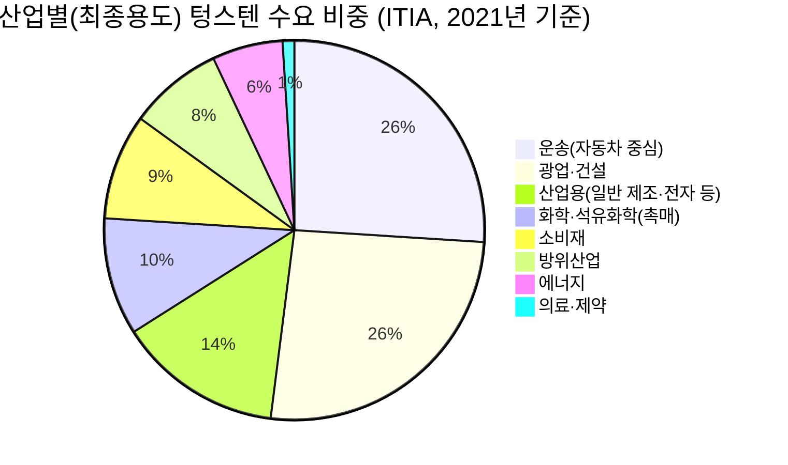
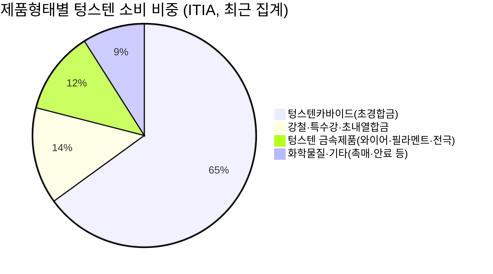
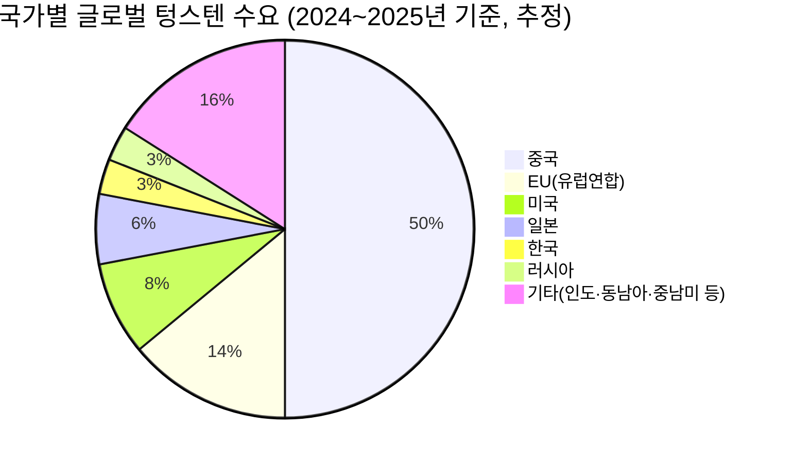
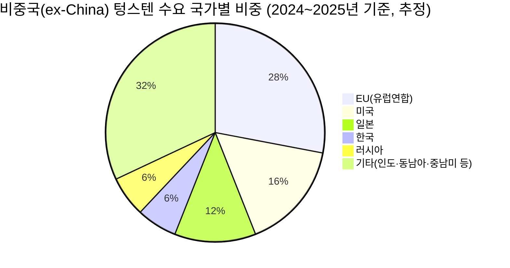

# 문서 1. 텅스텐 총 수요 조사

> 조사 기준일: 2026-07-22
> 구성: 1부 산업별 수요 / 2부 국가별 수요 (각각 독립 조사 후 orchestrator 검증·병합)
> context: 중국의 전략광물 통제에 따른 텅스텐 가격 전망 조사

---

## 종합 (Orchestrator Synthesis)

두 파트의 조사를 교차하면 텅스텐 수요의 구조는 다음 세 문장으로 압축된다.

1. **산업 축**: 총수요의 60~65%가 초경합금(절삭·내마모 공구)이며, 가격 비탄력적 수요(방위산업 ~8→12-15% 확대 중, 반도체 WF6 — 계약가 70~90% 인상에도 구매 지속)는 합산 15~20% 수준에 그친다. 최대 비중인 일반 초경/공구 부문은 2026년 2분기부터 "즉시구매·재고축소" 형태의 가격 저항이 실제로 관측된다 — 즉 **비중이 큰 곳이 탄력적이고, 비탄력적인 곳은 비중이 작다**는 비대칭이 수요 측의 핵심 구조다.
2. **국가 축**: 중국이 단독으로 글로벌 수요의 약 50%를 소비하며(2024년 70,768톤, 안태과), 여기에 정부 비축 flow(~3-4%)와 비중국 신규 광산의 장기 오프테이크 선점(~6-8%)을 더하면 **글로벌 수요의 약 58~61%가 순수 가격 논리 밖에서 귀속처가 결정**된다. 잔여 스팟 시장(~40%)이 얇기 때문에 작은 수급 변화가 큰 가격 변동으로 증폭된다(2025년 정광 +107%, APT +104%).
3. **가격 급등(2026-01~07)에도 수요가 여전한가?** — 방산·반도체는 "그렇다"(물량 지속+구조적 확대), 최대 비중인 일반 공구는 "부분적으로 아니다"(중국 내수가 고점 대비 -50%대 조정, CTIA가 반복 확인한 구매 관망). 국제 수출가가 고점을 유지하는 것은 해외 실수요의 강함보다 **중국 수출허가제에 의한 인위적 희소성(scarcity rent)**의 성격이 강하다. 이 "이중 시장(중국 내수 약세 vs 국제가 고착)" 구도가 이후 문서(밸류체인·하방 시나리오·전체 개괄)의 공통 전제가 된다.

투자 관점의 리스크/리턴 비: 수요 측에서 가격을 추가로 밀어올릴 재료(방산 +12%/년, 미국 DFARS 2027 비중국산 강제)는 이미 상당 부분 가격에 반영된 반면, 하방 트리거(중국 쿼터 완화 시 내수-국제가 괴리 해소, 초경 부문 재고 소진 후 공백기)는 아직 실현되지 않은 상태로 남아 있다.

---

---

# 1.1 산업별 텅스텐 수요

> 조사 기준일: 2026-07-22 / 작성: 리서치 서브에이전트
> 조사 범위: 최근 2년(2024-07~2026-07), 특히 최근 6개월(2026-01~2026-07) 가격 급등기 산업별 수요 반응

---

## 0. 요약 (핵심 5문장)

1. 글로벌 텅스텐 수요는 **초경합금(절삭·내마모 공구)이 60~65%로 압도적 1위**이며, 국제텅스텐산업협회(ITIA) 기준 최종산업별로는 운송(자동차 중심, 26%)·광업건설(26%)·산업용(14%)·화학·석유화학(10%)·소비재(9%)·방위산업(8%)·에너지(6%)·의료(1%) 순이다.
2. 중국이 2025-02-04 시행한 텅스텐 수출허가제 이후 APT(파라텅스텐산암모늄) 국제가격은 2025-01 $335~345/mtu → 2026-04 $3,000~3,185/mtu로 **약 9배(연초 대비도 +350%)** 폭등했으나, 2026-03 중순 이후 중국 **내수가격은 고점 대비 50~57% 조정**되어 2025년 말 수준으로 되돌아간 반면, 국제 수출가격은 7월 중순까지도 $3,000~3,265/mtu 박스권을 유지하는 **"국내-국제 가격 괴리(fragmentation)"** 가 뚜렷하다(Fastmarkets, 2026-06 보도).
3. 가격이 폭등해도 수요가 꺾이지 않는 산업은 **방위산업(관통탄·미사일, 대체재 없음·전량 소모형)** 과 **반도체(WF6 CVD 배선·AI 칩 수요 확대, 공정 재인증 부담으로 락인)** 두 곳이 뚜렷하며, 반도체 국내 공급사(후성·SK스페셜티)는 2026년 계약가를 삼성전자·SK하이닉스 등에 **70~90% 인상 통보**했음에도 구매가 지속되고 있다(더구루, 2026-06-10).
4. 반면 **초경합금/일반 절삭공구 수요는 2026년 2분기부터 관망세·재고 축소 신호가 뚜렷**하다(중국텅스텐산업협회 CTIA, 2026-04·07 보도: "즉시 필요분만 구매", "구매력이 구매자 쪽으로 이동"). SK하이닉스의 낸드 워드라인 텅스텐→몰리브덴 전환처럼 언론에 자주 노출되는 "대체" 뉴스는 실제 물량 기준 영향이 미미하다(반도체용 몰리브덴 수요는 전체 몰리브덴 수요의 0.1~0.3%에 불과, 아주경제 2026-07-01).
5. 공급 측 구조(중국 채굴쿼터 3년 연속 매년 약 6%↓, 2026년 15개사만 수출 허가)가 가격 상승의 1차 원인이고, 수요 측에서는 방산·반도체가 가격에 관계없이 물량을 흡수하는 반면 일반 공구 수요는 가격 저항이 나타나는 **"이중 시장(bifurcated demand)"** 구도가 2026년 상반기의 핵심 특징이다.

---

## 1. 산업별 수요 비중 — 원 그래프

텅스텐 통계는 **① 1차 가공형태(첫 제품형태) 기준**과 **② 최종산업(end-use) 기준**의 두 가지 분류체계가 혼용된다. 두 체계는 서로 다른 잣대이므로 숫자를 단순 합산하면 안 되며, 아래에 둘 다 제시한다.

### 1-1. 최종산업(end-use)별 수요 비중 — 메인 차트

출처: International Tungsten Industry Association(ITIA), *Applications & Markets*, 2021년 집계 기준 (ITIA 웹사이트 게재본, 2026-07 확인 시점까지 더 최신 공식 갱신본 미확인). [출처: ITIA, "Applications & Markets"](https://www.itia.info/applications-markets/)

* "운송" 26%의 약 4분의 3은 자동차 부문이며, 이는 차량에 텅스텐이 직접 들어간다는 뜻이 아니라 **자동차 부품 가공용 초경합금 절삭공구·금형 수요**가 대부분이다(간접 수요). [출처: ITIA 자료 인용 2차 소스](https://www.itia.info/applications-markets/)
* 지역별로는 2021년 기준 중국이 최종소비의 36%를 차지(자국 내 가공·소비), 유럽 20%, USMCA(북미) 17%, 일본 8%, 기타아시아 8%였다. 즉 중국은 세계 최대 생산국이자 최대 소비국이다.
* 반도체(WF6 CVD, 스퍼터링 타겟)는 이 8개 범주 중 "산업용"과 "에너지"에 흩어져 포함되며 별도 항목으로 분리되어 있지 않다 — 아래 3-4절에서 별도 추정치를 제시한다.

### 1-2. 1차 가공형태(제품형태)별 수요 비중 — 보조 차트

출처: ITIA, 동일 페이지. [출처: ITIA, "Applications & Markets"](https://www.itia.info/applications-markets/); 미국 시장 한정 수치는 USGS *Mineral Commodity Summaries 2026* 교차검증. [출처: USGS, "Tungsten — Mineral Commodity Summaries 2026", 2026](https://pubs.usgs.gov/periodicals/mcs2026/mcs2026-tungsten.pdf)

* USGS는 미국 한정으로 "초경합금 60%, 나머지는 합금·특수강, 전기전자·조명용 부품, 화학물질"로 기술하며 ITIA의 글로벌 65%와 대체로 정합적이다. [출처: USGS MCS 2026, 2026](https://pubs.usgs.gov/periodicals/mcs2026/mcs2026-tungsten.pdf)
* EU Raw Materials Strategic Partnership 팩트시트는 EU 역내 기준 "절삭·밀링공구 31%, 광업·건설공구 14%, 촉매·안료 14%, 항공우주·에너지 14%"로 다소 다른 구간화를 제시한다(방법론 차이). [출처: European Commission, RMSP Tungsten Factsheet](https://single-market-economy.ec.europa.eu/document/download/0a0c4a15-afb9-497b-851e-9962c5fe6813_en?filename=RMSP_Tungsten_Factsheet_V2.pdf)

### 1-3. 방산·반도체 별도 추정 (교차 카테고리)

방산과 반도체는 위 두 분류 모두에서 "숨어있는" 카테고리이므로 별도 추정치를 정리한다.

| 항목 | 비중 추정 | 기준연도 | 출처 |
|---|---|---|---|
| 방위산업 (ITIA end-use) | 8% | 2021 | ITIA |
| 방위산업 (Project Blue) | 약 12% (2026), 15%로 확대 전망 | 2026 / 2027~28e | Project Blue 리서치원 Janine Le Roux 코멘트, 2026-03 보도 [The Oregon Group 재인용](https://theoregongroup.substack.com/p/why-tungsten-prices-are-rising-so) |
| 방위산업 (일부 시장분석) | 3~7% | — | discoveryalert.com.au, 2026 |
| 반도체(WF6 함유 W 기준, 저자 추정) | 약 6~8% (물량 기준, 계산치) | 2025~26 | 아래 3-4절 산출근거 참조 — **공식 통계 아님, 저자 계산 추정치** |

방산 비중 추정치가 8%~15%로 자료마다 크게 벌어지는 이유는 (a) 기준연도 차이(2021 vs 2026), (b) 2026-03 이란 전쟁 발발 이후 군수 소비가 실제로 급증했을 가능성, (c) 조사기관별 정의(완제품 vs 원료 기준) 차이 때문으로 판단된다. 방향성(비중 확대)에는 자료 간 이견이 없다.

---

## 2. 산업별 상세 — 가격 비탄력성 평가

### 2-1. 초경합금 / 절삭공구 (전체의 60~65%, 최대 비중)

* **용도**: 금속절삭 인서트, 드릴비트, 마모부품, 광산·건설·오일가스 시추공구, 금형. [출처: USGS MCS 2026](https://pubs.usgs.gov/periodicals/mcs2026/mcs2026-tungsten.pdf)
* **대체재**: 세라믹, 다결정다이아몬드(PCD), 입방정질화붕소(CBN), 몰리브덴·니오븀·티타늄 카바이드 계열이 일부 틈새(고속 정삭, 경화강 가공)에서 대체 가능하나, "대부분은 텅스텐 함량을 줄이는 수준이지 완전 대체가 아니다." [출처: 시장 조사 2차 종합, ScienceDirect 인용 기반 검색 요약](https://www.sciencedirect.com/)
* **원가 비중/전가력**: Sandvik·Kennametal 등 글로벌 절삭공구사는 분기별 원자재지수에 연동한 자동 가격조정(가격 전가) 계약구조를 운영 — 즉 **원가 상승분을 최종 제조업체에 전가하는 구조적 메커니즘이 이미 존재**한다. [출처: Investing.com, "Kennametal: What the Tungsten Spike Is Hiding", 2026](https://www.investing.com/analysis/kennametal-what-the-tungsten-spike-is-hiding-200681090)
* **비탄력성 vs 경기민감성의 혼재**: Kennametal은 2026회계연도(2025-07 시작) 조정 EPS 가이던스 $3.75~4.00 중 약 **$2.45가 "가격-원자재 타이밍 이익"** 에서 나온다고 밝혔다 — 이는 원가 상승을 가격에 전가해 오히려 마진이 개선된 사례로, 절삭공구 업체 입장에서는 비탄력적 수요를 활용한 이익이다. 그러나 동시에 "절삭공구는 소모품이지만 소모 속도는 공장가동률에 정확히 연동한다"는 경고도 병기했다(2020년 코로나 충격 시 매출 -14%, 조정EPS $2.52→$1.26 급락 전례). [출처: Investing.com/Yahoo Finance, 2026](https://finance.yahoo.com/markets/commodities/articles/kennametal-tungsten-spike-hiding-091755923.html)
* **2026년 상반기 실제 반응**: 중국텅스텐산업협회(CTIA)는 2026-04-29·07-07·07-08 보도에서 "카바이드·공구 제조사들이 재고 확보에 관심이 없고 즉시 필요량만 구매", "협상력이 구매자 쪽으로 이동", "다운스트림 구매의지 위축"을 반복 확인했다 — **가장 큰 비중을 차지하는 이 부문에서 2026년 2분기 이후 수요 둔화(가격 저항) 신호가 가장 뚜렷**하다. [출처: CTIA, 2026-04-29](http://news.chinatungsten.com/en/tungsten-product-news/174931-tpn-16107.html), [CTIA, 2026-07-07](https://www.ctia.com.cn/en/news/51337.html), [CTIA, 2026-07-08](https://www.ctia.com.cn/en/news/51387.html)
* **결론**: 구조적으로는 대체 곤란·전가 용이(비탄력적)이지만, **물량(수요량) 자체는 경기·가격에 민감**하다. "가격이 올라도 쓸 수밖에 없다"는 명제는 개별 부품 단위에서는 맞지만, 총 구매량은 재고조정·구매연기를 통해 실제로 줄어들고 있다.

### 2-2. 강철·합금(고속도강 HSS, 특수강, 초내열합금)

* **용도**: 고속도강(HSS) 절삭공구, 내열·내마모 특수강, 항공우주·발전용 초내열합금(superalloy). [출처: samaterials.com](https://www.samaterials.com/content/high-speed-steel-vs-tungsten-steel.html)
* **비탄력적 세부군 — 초내열합금**: 항공우주용 초내열합금은 AMS7725(텅스텐중합금) 등 소재 규격 인증이 필요하며, 텅스텐은 레늄(Re)과의 미세 배합 비율에 따라 "프레클(freckle) 결함"·TCP상 형성 위험이 달라져 **함량 변경 자체가 사실상 재인증을 요구** — 전형적 스펙 락인으로 가격에 관계없이 구매해야 한다. [출처: USPTO 특허문헌 종합, ITIA "Tungsten in Superalloys" 2024](https://www.itia.info/wp-content/uploads/2024/06/ITIA_TISA_29052024.pdf)
* **탄력적 세부군 — 고속도강(HSS)**: HSS는 "텅스텐 1을 몰리브덴 약 2로 대체 가능"하며, Mo 비중이 높은 M계열 HSS는 W계열(T계열) 대비 약 30% 저렴하다고 알려져 있다 — 즉 **W/Mo 상대가격에 따라 실제 스위칭이 일어나는 구간**이다. [출처: tuspipe.com, HSS 성분·성능 자료 종합](https://www.tuspipe.com/blog/high-speed-steel/)
* **최근 동향**: 페로몰리브덴 가격이 최근 톤당 30만 위안(약 6,850만 원)을 돌파, 3년 만에 최고치를 기록했다 — 이는 텅스텐 대신 몰리브덴을 쓰려는 수요가 늘면서 **Mo 가격도 동반 상승**하고 있음을 시사하며, "대체재로의 전환"이 텅스텐 가격을 낮추는 요인으로 작용하기보다는 두 금속이 함께 강세를 보이는 국면임을 보여준다. [출처: 아주경제, 2026-07-01](https://www.ajunews.com/view/20260701135954633)

### 2-3. 방위산업 (텅스텐 관통자, 미사일 안정화장치 등)

* **용도**: 120mm APFSDS 등 운동에너지 관통탄(1발당 5~12kg 텅스텐 소요), 미사일·드론 부품, 항공기/헬기 평형추. [출처: hyperionmt.com](https://www.hyperionmt.com/en/products/defense/machining-components/tungsten-carbide-penetrators/); [tungsten-alloy.com](http://www.tungsten-alloy.com/tungsten-penetrator-ammunition-components.html)
* **비탄력성의 근거**:
  1. **대체재 사실상 부재** — 열화우라늄(DU)이 대체재이나 정치적·환경적 제약으로 서방 다수국이 기피, 텅스텐중합금(WHA, W 90~97%)이 사실상 유일한 실전 대안.
  2. **일회성 소모재** — 발사된 탄약은 회수 불가능하여 재고 보충 수요가 지속적으로 발생.
  3. **원가 비중 미미** — 무기체계 전체 비용에서 텅스텐 재료비가 차지하는 비중이 작아 가격 상승이 조달 결정에 미치는 영향이 제한적.
  * 인용: "Defense demand for tungsten is inelastic—the US military will pay almost any price to secure ammo." [출처: Joshua S., Substack, 2026](https://joshuas1.substack.com/p/tungsten-the-metal-underneath-a-potential)
* **최근 수요 증가 근거**: Project Blue는 2026년 군사용 텅스텐 소비가 **전년 대비 12% 증가**할 것으로 전망했으며, 이는 헬기·전투기·탄약 수요를 포괄한다. 2026-03 발발한 미국-이란 군사 긴장이 이 전망의 배경으로 지목된다. 방산이 텅스텐 시장에서 차지하는 비중은 현재 약 12%에서 2027~28년 15%까지 확대될 것으로 전망된다(재고 보충 수요 지속). [출처: The Oregon Group, Project Blue 리서치원 인용, 2026-03](https://theoregongroup.substack.com/p/why-tungsten-prices-are-rising-so)
* 미국 국방부는 2027-01-01부터 중국·러시아·이란·북한산 텅스텐 분말·텅스텐중합금(WHA)의 국방조달을 전면 금지하는 규정(DFARS 225.7018-2, FY2024 NDAA §854)을 시행 예정 — 이는 **가격과 무관하게 "비중국산" 텅스텐에 대한 강제적 추가 수요**를 만들어내는 구조적 요인이다(수요측 프리미엄). [출처: Crowell & Moring 법률자문, 2026](https://www.crowell.com/en/insights/client-alerts/dod-expands-restrictions-on-supply-chain-for-certain-magnets-tantalum-and-tungsten); [Pillsbury Law, 2026](https://www.pillsburylaw.com/en/news-and-insights/fy2026-ndaa-sourcing-restrictions-critical-minerals-advanced-batteries.html)
* **결론**: 조사된 8개 산업 중 **수요 비탄력성이 가장 명확하게 확인되는 부문**. 가격 급등에도 수요가 줄지 않을 뿐 아니라 지정학적 요인(이란 전쟁, 비중국산 요구)으로 오히려 구조적으로 확대되고 있다.

### 2-4. 반도체 (W CVD 배선, 스퍼터링 타겟)

* **용도**: 육불화텅스텐(WF6)을 CVD 공정 전구체로 사용해 첨단 로직·메모리 칩의 콘택트 플러그·비아·워드라인 배선을 형성. 미세공정이 진행될수록(선단공정 전환) 칩 1개당 텅스텐 증착 스텝이 늘어 수요가 구조적으로 증가한다. [출처: IndexBox, "Tungsten CVD Precursors Market", 2026](https://www.indexbox.io/blog/tungsten-cvd-precursors-market-forecast-points-higher-toward-2035-on-semiconductor-scaling-demand/)
* **글로벌 WF6 수요**: 2020년 약 4,500톤 → 2025년 약 9,000톤 → 2026년 11,000톤 이상 전망(AI GPU·HBM 수요 확대가 견인). [출처: globalsemiresearch.substack.com, 2026](https://globalsemiresearch.substack.com/p/tungsten-hexafluoride-the-semiconductor)
* **반도체 총수요 대비 비중(저자 계산 추정치)**: WF6의 텅스텐 함유율은 원자량 기준 약 61.7%(W 183.84 / WF6 297.83)다. 2025~26년 WF6 수요 9,000~11,000톤을 함유 텅스텐(금속 W)량으로 환산하면 약 5,500~6,800톤이며, 이를 2025년 세계 텅스텐 광산 생산량(USGS 추정 약 85,000~90,000톤, W 함유 기준)과 대비하면 **약 6~8%** 수준으로 추정된다. **이 수치는 공식 통계가 아니라 원자량 환산에 기반한 저자의 자체 계산이며, WF6 외 스퍼터링 타겟용 수요는 포함하지 않았다.**
* **비탄력성 근거**: 반도체 공정은 소재 변경 시 전체 공정 재인증이 필요해 스펙 락인이 극심하다. 2026-06-10 기준 후성·SK스페셜티는 삼성전자·SK하이닉스·DB하이텍·매그나칩 등에 **2026년 계약가 70~90% 인상을 통보**했으며, WF6 가격은 전년 동월 대비 232.7% 급등했다. 그럼에도 반도체 업체들이 구매를 지속하는 것은 대체 불가능성을 방증한다. 일본 업체(간토덴카·센트럴글래스, 세계 WF6 공급의 약 25% 점유)가 하반기 감산을 예고해 국내 대체 공급망 확보 필요성이 커진 상태다. [출처: 더구루, 2026-06-10](https://www.theguru.co.kr/news/article.html?no=102878)
* **"미미한 대체" 사례 — 반드시 기록**: SK하이닉스는 375단 3D 낸드플래시 워드라인 소재 일부를 텅스텐에서 몰리브덴으로 전환(2026년 상반기 발표). 미세화된 배선에서 몰리브덴이 텅스텐보다 낮은 저항을 구현해 신호전달 속도를 높일 수 있다는 기술적 이유다. 삼성전자·마이크론도 유사한 전환을 검토 중이며 업계는 "낸드→파운드리→D램" 순으로 확산될 것으로 본다. **다만 반도체용 몰리브덴 수요는 현재 글로벌 전체 몰리브덴 수요의 0.1~0.3%에 불과**해, 텅스텐 총수요에 미치는 실질적 하방 압력은 현재로서는 미미하다고 판단된다. 다만 이 전환이 파운드리·D램까지 확산될 경우의 중장기 영향은 추적이 필요한 "트리거" 사안으로 문서에 남겨둔다. [출처: 아주경제, 2026-07-01](https://www.ajunews.com/view/20260701135954633); [디일렉, 375단 낸드 몰리브덴 도입 보도](https://www.thelec.kr/news/articleView.html?idxno=57914)
* **참고 — 중국 반도체 공급망 영향**: 국내에서는 반도체 핵심 소재 WF6 부족 현상이 심화되며 후성 등이 반사이익을 기대한다는 보도가 있다(국내 대체 공급망 구축 기회). [출처: 더구루, 관련 보도](https://www.theguru.co.kr/news/article.html?no=102878)

### 2-5. 전기차(EV) / 자동차

* **용도**: ① (직접) 배터리팩·전기모터 로터의 무게중심 조정용 텅스텐중합금 평형추(카운터웨이트), ② (간접·비중이 훨씬 큼) 배터리 전극 정밀 가공, 알루미늄 용접 전극, 모터용 규소강판 절단 등에 쓰이는 초경합금 절삭공구. [출처: tungstenmetalsgroup.com, "Ferrotungsten and its use in the EV industry"](https://www.tungstenmetalsgroup.com/blog-blog/ferrotungsten-ferroalloys-in-the-ev-industry); [almonty.com](https://almonty.com/powering-the-future-tungsten-w-and-electric-vehicles/)
* **규모(미미하지만 기록)**: 신에너지차(NEV) 배터리 안정화장치용 텅스텐 소비량은 2025년 약 1,500톤으로 전년 대비 22% 증가했다. 이를 2025년 세계 텅스텐 수요(농축광 기준 13만톤 이상)와 대비하면 **약 1% 안팎**에 불과한 작은 비중이다. [출처: CTIA 관련 보도 종합, 2025~26](https://www.ctia.com.cn/en/news/43671.html)
* 시장조사 보고서 기준 자동차 부문은 텅스텐중합금(WHA) 매출의 약 12.4%를 차지(2025)한다고 하나, 이는 카운터웨이트·가공용 공구를 모두 합친 광의의 수치로 해석에 주의가 필요하다. [출처: dataintelo.com, "Tungsten Heavy Alloys Market", 2026](https://dataintelo.com/report/global-tungsten-heavy-alloys-market)
* **결론**: EV 확대는 언론에서 텅스텐 수요의 "차세대 성장동력"으로 자주 인용되지만(예: EU 2026-03 신규 EV 등록 +48.9%), 순수 텅스텐 함유량 기준으로는 총수요에 대한 영향이 현재 미미하다. 사용자가 예시로 든 "SK하이닉스 몰리브덴 전환"과 대칭적인 패턴 — 즉 실제 임팩트는 작지만 향후 내러티브의 트리거가 될 수 있어 기록해 둔다.

### 2-6. 조명 (필라멘트, 전극)

* **용도**: 할로겐·특수 백열등 필라멘트, 자동차 전조등, 항공 신호등, 의료 진단장비(X선관 등). 유럽 시장에서는 "와이어"(필라멘트 등) 부문이 2024년 지역 시장의 42.8%를 차지한다는 조사도 있으나, 이는 유럽 특유의 제품 구성으로 세계 평균과는 차이가 있을 수 있다. [출처: marketdataforecast.com, "Europe Tungsten Market"](https://www.marketdataforecast.com/market-reports/europe-tungsten-market)
* LED가 일반 조명·차량 전조등을 빠르게 대체하며 구조적으로 축소되는 추세이나, **LED가 재현할 수 없는 스펙트럼·열특성이 필요한 항공 신호등·의료기기 등 니치 영역은 잔존**한다. 글로벌 텅스텐 필라멘트 시장 규모는 2024년 12억 달러에서 2033년 18억 달러로 연 5.0% 성장 전망(니치 시장 자체는 견조하나 텅스텐 총수요에서 차지하는 비중은 크지 않음). [출처: verifiedmarketreports.com](https://www.verifiedmarketreports.com/product/tungsten-filaments-market/)
* **탄력성 평가**: 비교적 대체재(LED)가 뚜렷이 존재하는 몇 안 되는 구간으로, 가격 급등 시 잔존 니치를 제외하면 수요가 축소될 가능성이 상대적으로 높다(탄력적).

### 2-7. 화학촉매 (석유화학·정유용)

* **용도**: 암모늄메타텅스테이트(AMT) 등을 전구체로 한 수소화분해·탈황·탈질 촉매. 청정연료 규제 강화, 중질유 정제 비중 확대로 구조적 수요 증가 추세. [출처: 시장조사 종합, AMT 시장 $0.90B(2025)→$1.16B(2030), CAGR 5.2%](https://finance.yahoo.com/markets/commodities/articles/ammonium-metatungstate-market-forecast-2030-080300887.html)
* **탄력성 평가**: 촉매 소재가 전체 정제원가에서 차지하는 비중이 낮아 가격 전가가 상대적으로 용이(비탄력적 성향)하지만, 전체 텅스텐 수요에서 차지하는 비중(ITIA 기준 화학·석유화학 10%) 자체가 크지 않아 텅스텐 가격 결정력은 제한적이다.

### 2-8. 기타 (의료 방사선 차폐, 낚시추·다트, 보석 등)

* 비중은 1% 내외로 작고, 납·황동 등 대체재가 존재해 가격 급등 시 가장 먼저 대체가 일어나는 전형적 탄력적 수요 구간이다. [출처: ITIA end-use "의료·제약 1%"](https://www.itia.info/applications-markets/)

---

## 3. 최근 2년 타임라인 (2024-07 ~ 2026-07): 중국 수출통제와 가격·수요 반응

### 3-1. 정책 타임라인

| 시점 | 내용 | 출처 |
|---|---|---|
| 2023-07 | 중국, 갈륨·게르마늄 수출통제 (텅스텐 통제의 전조) | Global Trade Alert |
| 2023-08 | 중국, 텅스텐 분말·카바이드 소재 관련 수출허가 요건 도입(초기 단계) | 시장 2차 자료 종합 |
| 2024-08 | 중국, 안티모니 수출통제 | discoveryalert.com.au |
| **2025-02-04** | 중국 상무부·해관총서, **텅스텐·텔루륨·비스무트·몰리브덴·인듐 관련 41개 10단위 HS코드 수출통제 공식 시행**(국가안보·비확산 명분, 최종사용자/용도 증명 요구) | [IEA Policy DB](https://www.iea.org/policies/26795-decision-to-implement-export-controls-on-tungsten-tellurium-bismuth-molybdenum-and-indium-related-items); [Fastmarkets, 2025](https://www.fastmarkets.com/insights/chinese-tungsten-product-prices-surge-2025-export-controls-fresh-demand/) |
| 2025년 중 | 중국 채굴쿼터 58,000톤으로 전년 대비 6.45% 감축(3년 연속 매년 약 6%씩 감축 기조) | 시장 2차 자료 종합 |
| 2025-12-26 | 중국 상무부, **2026~27년 텅스텐·안티모니·은 수출허가 기업 15개사 화이트리스트 공고**(품목도 20개로 확대), 2025-12-30 로이터 확인 보도 | [rareearthexchanges.com](https://rareearthexchanges.com/news/chinas-exclusive-export-list-for-critical-metals-2026-2027-whos-in-and-why-it-matters/) |
| 2026-01 | 화이트리스트 시행 개시, 수출 주체 추가 집중 | 시장 2차 자료 종합 |
| 2026-03 | 미국-이란 군사 긴장 격화(전쟁) → 방산 수요 자극 요인 추가 | Newstarget, Mining.com 등 2026-03 보도 |
| 2027-01-01(예정) | 미국 국방부, 중국·러·이란·북한산 텅스텐분말·WHA 국방조달 전면 금지(FY2024 NDAA §854) | Crowell & Moring, 2026 |

### 3-2. 가격 타임라인 (APT 국제가 기준, USD/mtu WO3)

| 시점 | APT 가격 | 전년동기대비/누적 | 출처 |
|---|---|---|---|
| 2020년 | $250/mtu 미만 | 기준선 | MMTA |
| 2023년 (연평균) | 텅스텐정광 65%WO3 약 $16,800/톤 | — | 시장 2차 자료 |
| 2024-05-21 | 중국 텅스텐정광 10년래 최고치(울프라마이트 $21,600/t, 셸라이트 $21,400/t) | — | 시장 2차 자료 |
| 2025-01-08 | $335~345/mtu | 기준점 | [Fastmarkets, 2025](https://www.fastmarkets.com/insights/chinese-tungsten-product-prices-surge-2025-export-controls-fresh-demand/) |
| 2025-12-31 | $1,050~1,115/mtu | 2025년 한 해 +218~220% | Fastmarkets, 2025 |
| 2026-01 | $900~940/mtu | — | Fastmarkets, "Tungsten 2026" |
| 2026-02 중순 | $1,650~1,900/mtu | 6주간 +63~94% | Fastmarkets, 2026 |
| 2026-04 (고점) | 로테르담 $3,185/mtu | 연초대비 +350%, 전년동기대비 +900% | [The Oregon Group, 2026](https://theoregongroup.substack.com/p/why-tungsten-prices-are-rising-so) |
| 2026-06-19 | 수입가(CIF 로테르담/볼티모어) $2,900~3,210/mtu | 전년동기대비 +575% | [Fastmarkets, "markets fragmenting", 2026-06](https://www.fastmarkets.com/insights/tungsten-markets-fragmenting-as-domestic-chinese-apt-market-diverges-from-exports/) |
| 2026-06-24 | 수출가(FOB 중국) $2,600~3,250/mtu | 전년동기대비 +631% | 위와 동일 |
| 2026-07 중순 | 유럽 APT $3,000~3,265/mtu | 고점대비 -0.2%, 연초대비 +240.5% | 시장 2차 자료 종합 |

같은 기간 중국산 페로텅스텐(75%W)은 2025-02 kg당 $43.59 → 2026-02 kg당 $181.75로 **1년 만에 +317%** 상승했다(버핏연구소, 2026-02-25 보도). [출처: buffettlab.co.kr, 2026-02-25](https://buffettlab.co.kr/news/view.php?idx=52997)

중국의 2025년 APT 수출물량은 782톤(2024년) → 243톤(2025년 1~11월 누적)으로 **약 70% 급감**했다(Fastmarkets). [출처: Fastmarkets, 2025](https://www.fastmarkets.com/insights/chinese-tungsten-product-prices-surge-2025-export-controls-fresh-demand/)

---

## 4. 최근 6개월 심층 (2026-01 ~ 2026-07): 급등 후 "국내·국제 시장 괴리"

이 구간이 사용자 질문("가격 급등에도 산업별 수요가 여전한가")의 핵심이며, 조사 결과 **단순히 "여전히 견조하다"고 답할 수 없는 중요한 반전**이 확인되었다.

### 4-1. 가격 흐름: 4월 고점 → 이후 중국 내수는 급락, 국제 수출가는 고점 유지

* 2026-03 중순부터 저점 대비 **누적 약 650%** 상승했던 텅스텐 원자재 가격은 이후 하락 반전했다. 중국 국내 시장에서는 텅스텐 원료가 고점 대비 약 30%, 텅스텐 스크랩 가격은 고점 대비 50% 이상 하락했다. [출처: 시장 2차 자료 종합, 2026-05~07]
* CTIA 보도에 따르면 2026-04-29 기준 중국 국내 가격은 이미 고점 대비 울프람광·백텅광 -28.6%, APT -22.4%, 텅스텐분말 -16.7%, 폐텅스텐봉 -50.4%까지 조정됐다. [출처: CTIA, 2026-04-29](http://news.chinatungsten.com/en/tungsten-product-news/174931-tpn-16107.html)
* 2026-05-15에는 중국 원자재 가격이 사상 최고치 대비 **누적 50% 하락**했다는 보도가 나왔다. [출처: CTIA 일본어판, 2026-05-15](https://www.ctia.com.cn/jp/prices/18558.html)
* 2026-07-07 기준 65%WO3 텅스텐정광 45.5만 위안/톤, APT 66만 위안/톤, 텅스텐분말 1,050위안/kg으로 각각 **고점 대비 약 56~57% 하락**해 2025년 말 수준으로 되돌아갔다. [출처: CTIA, 2026-07-07](https://www.ctia.com.cn/en/news/51337.html)
* 반면 국제 수출/수입 가격(FOB 중국, CIF 로테르담)은 2026-06~07 내내 $2,600~3,265/mtu 박스권을 유지했다. Fastmarkets는 이를 **"국내·국제 시장 괴리(fragmenting)"** 로 규정하며 원인으로 (a) 수출허가 요건이 해상 물동량 자체를 제한한 점, (b) 과거에는 중국 내수가와 국제가를 연결하던 차익거래(arbitrage) 메커니즘이 수출쿼터 때문에 약화된 점을 지목했다. [출처: Fastmarkets, 2026-06](https://www.fastmarkets.com/insights/tungsten-markets-fragmenting-as-domestic-chinese-apt-market-diverges-from-exports/)

**해석**: 국제가격이 고점권을 유지하는 것은 "해외 실수요가 여전히 강하다"는 신호라기보다, **중국의 수출 라이선스·화이트리스트에 의한 인위적 공급 제한(scarcity rent)** 의 성격이 강하다. 반면 중국 내수가격의 급락(고점 대비 -50%대)은 **중국 내 다운스트림(카바이드·공구 제조업체)의 실제 구매력·구매의지가 약화**되고 있음을 보여주는 더 신뢰할 수 있는 수요 지표다.

### 4-2. 수요 측 코멘트 (CTIA, 2026-04~07 반복 확인)

* "지속적인 일방적 가격 상승 후 심리 냉각", "투기심리 약화와 저가 매수 회피 심리로 신규 주문 부족" (2026-04-29)
* "카바이드 제조사·공구 생산자들이 재고 확보에 거의 관심을 보이지 않으며 즉시 필요한 수량만 구매", "구매자들의 협상력 강화, 판매자는 높은 가격 수용을 거부" (2026-05-15 관련)
* "텅스텐 가격이 일반적으로 약한 소비 속에서 압박을 받고 있으며, 시장 거래가 교착 상태" — 원인으로 원자재비용 부담, 가격 하락 추세에 따른 재고 축소·구매 지연, 계절적 비수기, 거시경제 불확실성을 지목 (2026-07-08) [출처: CTIA, 2026-07-08](https://www.ctia.com.cn/en/news/51387.html)

### 4-3. 산업별 온도차 — 방산·반도체는 견조, 일반 공구는 둔화

* **방산**: Project Blue는 이란 전쟁 발발(2026-03)을 배경으로 2026년 군사용 텅스텐 소비가 전년比 12% 증가할 것으로 전망 — 가격 조정 국면에서도 방산 수요 자체가 줄었다는 근거는 확인되지 않았다.
* **반도체**: 2026-06-10 시점에도 국내 WF6 공급사(후성·SK스페셜티)는 계약가 70~90% 인상을 관철하고 있으며, 이는 반도체 업체들이 높은 가격에도 구매를 지속하고 있다는 방증이다. AI 반도체발 수요 확대가 배경이다.
* **초경합금/일반 공구**: 위 4-2절과 같이 관망·재고축소·즉시구매 전환 등 **명확한 수요 둔화(가격 저항) 신호**가 2026년 2분기부터 반복적으로 보도되고 있다.
* **결론**: "가격 급등에도 산업 수요가 여전한가"라는 질문에 대해, **방산·반도체는 "그렇다"**, **최대 비중을 차지하는 초경합금/일반 공구 부문은 "부분적으로 아니다"(수요 둔화 시작)** 로 답이 갈린다. 이 비대칭이 2026년 하반기 이후 가격의 방향성(추가 상승 여력 vs 조정 지속)을 가늠하는 핵심 변수로 판단된다.

### 4-4. 공급 측 병행 변수 (참고)

* 알몬티 인더스트리즈(Almonty Industries)의 한국 상동광산(영월)이 30여 년 만에 재가동, 2026-03 1단계 상업생산 완료, 2026-07-01부터 텅스텐정광 판매 개시(연산 약 2,300톤, 미국 45%·국내 55% 배분 계획). 2027년 2단계 완료 시 연산 4,600톤으로 확대, 비중국 세계수요의 최대 약 40% 공급 목표. [출처: Almonty 보도자료, 2026-03; TipRanks, 2026-07](https://www.tipranks.com/news/company-announcements/almonty-begins-tungsten-processing-at-sangdong-mine-transitioning-to-revenue-operations); [이투데이, 2026-03](https://v.daum.net/v/20260323180117479)
* 이는 수요보다는 공급 측 변수이지만, 향후 "비중국 공급 확대 → 가격 하방 압력"의 트리거가 될 수 있어 기록해 둔다.

---

## 5. 종합 판단 — "중대성·리스크/리턴" 관점 재정리

| 산업(트리거성 사실) | 표면적 임팩트 | 실질 중대성 평가 | 판단 근거 |
|---|---|---|---|
| SK하이닉스 등 낸드 워드라인 W→Mo 전환 | 가격 하락 요인처럼 보임 | **미미함 (현재 기준)** | 반도체용 Mo 수요는 전체 Mo수요의 0.1~0.3%; 텅스텐 총수요 대비 영향은 현재 계산상 무시 가능한 수준. 다만 파운드리·D램까지 확산 시 중장기 트리거 될 가능성은 잔존 |
| EV향 텅스텐 카운터웨이트 수요 성장(+22%) | 신성장 수요처럼 보임 | **미미함** | 총수요 대비 약 1%; 성장률은 높으나 절대 규모가 작아 가격 결정력 없음 |
| 방위산업 수요 +12%(2026e) | 구조적 수요 확대 | **중대함** | 대체재 부재, 일회성 소모재, 지정학적 강제수요(이란전쟁, 美 NDAA 비중국산 요구) — 가격 무관 구매 |
| 반도체 WF6 계약가 70~90% 인상 수용 | 고가에도 구매 지속 | **중대함** | 공정 재인증 부담으로 스펙 락인, AI 수요발 물량 자체가 증가 중 |
| 초경합금 다운스트림 "즉시구매·재고축소" (2026 2Q~) | 수요 둔화 신호 | **중대함(비중 최대)** | 전체 수요의 60~65%를 차지하는 최대 부문에서 나타난 신호이므로, 소규모 부문의 트리거보다 가격 전체 방향에 미치는 영향이 훨씬 큼 |
| 중국 국내-국제 가격 괴리(fragmentation) | 공급측 현상처럼 보임 | **중대함(수요 해석에 필수)** | 국제 고가가 "실수요"가 아니라 "수출쿼터에 의한 인위적 희소성"일 가능성을 시사 — 향후 쿼터 완화 시 국제가 급락 리스크 |

---

## 6. 확보하지 못한 데이터 / 한계

1. **최신(2025~2026) 공식 ITIA 산업별 수요 비중 갱신본**을 확인하지 못했다. 위 1절 원 그래프는 ITIA 웹사이트에 게재된 2021년 집계 기준이며, 이후 갱신 여부는 확인하지 못했다. 최근 2년의 구조 변화(반도체·방산 비중 확대)가 공식 통계에 아직 반영되지 않았을 가능성이 있다.
2. **반도체(WF6·스퍼터링 타겟) 부문의 텅스텐 총수요 대비 정확한 공식 비중 통계**를 찾지 못했다. 본 문서의 6~8% 추정치는 WF6 물량에 원자량 환산율(61.7%)을 적용한 저자 자체 계산이며, 스퍼터링 타겟용 수요는 포함하지 않아 과소추정일 가능성이 있다.
3. **중국의 텅스텐 전략비축(국가 재고) 규모, 내수 소비 통계**는 비공개로, 시장 추정치("내수 소비가 늘고 있다")만 확인했고 구체적 톤수는 확보하지 못했다.
4. **한국 초경공구·방산 개별 기업의 원가전가율·마진 영향 수치**는 확보하지 못했다(해외 대기업 Kennametal의 수치만 구체적으로 확보). 국내 텅스텐 관련주(자원개발·소재)의 구체적 실적 임팩트는 후속 조사가 필요하다.
5. **Almonty 상동광산의 실제 첫 출하 물량·판매가격 실적**은 2026-07-01 가동 개시 발표만 확인했고, 실측 판매 실적치는 조사 시점(2026-07-22) 기준 공개되지 않은 것으로 보인다.
6. 일부 2차 자료(예: "8~9월 가격 회복 전망")는 **예측성 서술**로, 실측 데이터가 아니므로 본 문서에서 사실로 인용하지 않고 배제했다. 조사 기준일(2026-07-22) 이후 시점의 데이터는 원천적으로 확보 불가능함을 명시한다.
7. 방산 비중 추정치가 자료별로 8%(ITIA 2021)~12~15%(Project Blue 2026~28e)~3~7%(기타)로 편차가 커, 단일 수치로 확정하지 못했다. 공식 국방 조달 통계 기반의 검증이 추가로 필요하다.

---

## 참고문헌 (주요 출처 모음)

* ITIA, "Applications & Markets" — https://www.itia.info/applications-markets/
* ITIA, "Tungsten in Superalloys" (2024) — https://www.itia.info/wp-content/uploads/2024/06/ITIA_TISA_29052024.pdf
* USGS, "Tungsten — Mineral Commodity Summaries 2026" — https://pubs.usgs.gov/periodicals/mcs2026/mcs2026-tungsten.pdf
* European Commission, RMSP Tungsten Factsheet — https://single-market-economy.ec.europa.eu/document/download/0a0c4a15-afb9-497b-851e-9962c5fe6813_en?filename=RMSP_Tungsten_Factsheet_V2.pdf
* Fastmarkets, "Chinese tungsten product prices surge over 200% in 2025..." (2025) — https://www.fastmarkets.com/insights/chinese-tungsten-product-prices-surge-2025-export-controls-fresh-demand/
* Fastmarkets, "Tungsten 2026: Geopolitics sets global tone" — https://www.fastmarkets.com/insights/tungsten-2026-geopolitics-sets-global-tone/
* Fastmarkets, "Tungsten markets fragmenting as domestic Chinese APT market diverges from exports" (2026-06) — https://www.fastmarkets.com/insights/tungsten-markets-fragmenting-as-domestic-chinese-apt-market-diverges-from-exports/
* The Oregon Group, "Why tungsten prices are rising so fast" (2026-03) — https://theoregongroup.substack.com/p/why-tungsten-prices-are-rising-so
* CTIA(중국텅스텐산업협회), 각 일자별 가격 동향 보도 — https://www.ctia.com.cn/en/
* 아주경제, "SK하이닉스 몰리브덴 도입에 中 몰리브덴값 3년 만에 최고" (2026-07-01) — https://www.ajunews.com/view/20260701135954633
* 더구루, 육불화텅스텐 관련 보도 (2026-06-10) — https://www.theguru.co.kr/news/article.html?no=102878
* 이투데이, "반도체 넘어 제조업 공급망 위기로…30년 잠들었던 상동광산 재가동" — https://www.etoday.co.kr/news/view/2602125
* 버핏연구소, "[원자재] 중국발 공급 죄기기…텅스텐 가격 300% 폭등" (2026-02-25) — https://buffettlab.co.kr/news/view.php?idx=52997
* Investing.com/Yahoo Finance, "Kennametal: What the Tungsten Spike Is Hiding" (2026) — https://www.investing.com/analysis/kennametal-what-the-tungsten-spike-is-hiding-200681090
* Crowell & Moring, DoD 공급망 규제 관련 (2026) — https://www.crowell.com/en/insights/client-alerts/dod-expands-restrictions-on-supply-chain-for-certain-magnets-tantalum-and-tungsten
* Almonty Industries / TipRanks, 상동광산 가동 보도 (2026-07) — https://www.tipranks.com/news/company-announcements/almonty-begins-tungsten-processing-at-sangdong-mine-transitioning-to-revenue-operations

---

# 1.2 국가별 텅스텐 수요

> 작성 기준일: 2026-07-22 / 통화 단위 표기가 없는 물량은 모두 "텅스텐 금속량(W content) 톤" 기준. 정광 환산(65% WO₃ 표준톤) 수치는 별도 표기.
> **데이터 신뢰도 주의**: 텅스텐은 (1) 거래의 대부분이 스팟이 아닌 연간계약으로 이루어지고, (2) 중국이 자국 소비를 우선하며 수출쿼터·수출허가제로 물량을 통제하고, (3) 서방 기관(Eurostat 등)도 기업 비밀유지 요청으로 무역통계 신뢰도에 한계가 있음을 EU 집행위 JRC 스스로 인정하고 있다. 따라서 아래 수치는 다수 출처를 교차검증한 **추정치**이며, 출처별 편차가 큰 항목은 범위로 표기했다.

---

## a) 글로벌 텅스텐 총수요의 국가별 분류

### 산출 근거

세계 텅스텐 협회(ITIA)가 유료 판매하는 연간 통계보고서(Annual Statistical Review, 2025년 8월 발간, US$2,000)의 표지 목차에는 "Demand for virgin tungsten by region (2023–2024)"이라는 항목이 존재함을 확인했으나 본문은 비공개였다[^itia]. 이에 따라 본 절의 수치는 아래 자료를 교차검증해 재구성한 것이다.

- **글로벌 총수요(순수 텅스텐 금속량 기준)**: EU 집행위 공동연구센터(JRC)의 2020년 EU 핵심원자재 팩트시트는 ITIA 자료를 인용해 "**2018년 글로벌 수요 104,500톤**(2012년 76,150톤에서 증가)"이라고 명시했고, 동시에 "**중국이 전 세계 유통 텅스텐의 약 절반(half)을 소비**"한다고 서술했다[^scrreen]. 2026년 4월 캐나코드 제뉴이티(Canaccord Genuity)는 "**2025년 글로벌 수요 약 143천 톤, 2035년 210천 톤 전망**"을 제시했다[^canaccord]. 두 수치의 성장 추세는 정합적이다(연 3~4% 성장 가정 시 2018년 104.5천→2025년 143천 톤은 그럴듯한 궤적).
- **중국 비중**: 안태과(安泰科, Antaike) 데이터를 인용한 궈신증권(国信证券) 2025-07-30 리포트는 "**2024년 중국 국내 텅스텐 소비량 70,768톤**"이라고 밝혔다[^guosen]. 이를 위 글로벌 수요치(143천 톤, 2025년)와 대비하면 중국 비중은 **약 49~50%**로, JRC의 "절반" 서술과 일치한다. 단, 검색 과정에서 발견된 다른 2차 자료는 "2024년 중국 42.67%", "2022년 58.3%" 등 편차가 큰 수치를 제시했는데[^chyxx], 이는 통계 기준연도·정광 환산 여부·2차(재생) 텅스텐 포함 여부가 자료마다 달라 발생하는 것으로 판단되며 원자료를 확인하지 못해 참고치로만 남긴다.
- **EU 비중**: JRC 팩트시트는 "2012~2016년 평균 EU 수요 10,010톤/년(세계 수요의 약 12%)", "**2018년 EU 수요 14,250톤(세계 수요의 13.6%)**"이라고 명시했다[^scrreen]. 2023~2025년 EU가 텅스텐을 전략원자재(SRM)·핵심원자재(CRM)로 재지정하고 방산 수요가 급증한 점을 고려해 본 보고서는 **14%**를 채택했다.
- **미국 비중**: USGS는 국가안보를 이유로 미국의 "실질소비(apparent consumption)"를 비공개(W, withheld)로 처리하며, 순수입의존도만 "**>50%**"로 공표한다[^usgs2026]. 다만 2025년(e) 미국의 텅스텐 함유 수입량은 광석·정광 1,700톤 + 기타 형태(APT·분말·초경 등) 10,000톤 = **총 11,700톤**, 수출은 광석·정광 1,400톤 + 기타 3,300톤 = 4,700톤으로, 순수입은 약 7,000톤 수준이다[^usgs2026]. 여기에 비공개 처리된 국내 재생(2차) 텅스텐을 더하면 실질소비는 대략 **9,000~12,000톤/년**으로 추정되며, 이는 글로벌 수요의 **약 7~8%**에 해당한다(추정치).
- **일본 비중**: 일본은 텅스텐 대부분을 수입에 의존하며(중국 의존율 80% 이상)[^geopinning], 자국 내 정확한 소비량 통계를 공개 자료에서 확인하지 못했다. JOGMEC 자료 및 초경공구 산업 규모(스미토모전공·미쓰비시머티리얼·다이도스틸 등)를 근거로 **5~6%**(약 7,000~8,000톤/년)로 추정한다. **확보하지 못한 데이터**로 명시한다.
- **한국 비중**: 한국 역시 공식 소비량 통계를 확인하지 못했다. The Diplomat(2026-06)은 한국을 "**1인당 세계 최대 텅스텐 소비국**"으로 서술했으나 절대량은 밝히지 않았다[^keia]. 초경합금 산업 규모(코로이·YG-1·태그텍 등)를 근거로 **약 2~3%**(3,000~4,000톤/년)로 추정한다. **확보하지 못한 데이터**로 명시한다.
- **러시아**: 세계 광산생산 2위~3위권(2025년 약 2,000~2,400톤, USGS)[^usgs2026]이며 자국 방산·항공 수요로 대부분 자체 소비. 3%로 추정.
- **기타(16%)**: 인도, 베트남(자국 Nui Phao 광산 생산분 상당수는 마스탄하이테크가 자국 및 서방에 판매), 대만, 동남아 절삭공구 벨트, 중남미(볼리비아 등), 중동·아프리카 신흥 수요 등을 포괄.

### 분석

1. **중국이 유일한 '단독 과반' 소비국**이라는 구조는 최소 2008년(궈신증권 리포트에 따르면 "2008년부터 중국 국내소비가 해외소비 총합을 추월") 이후 지속되고 있으며[^guosen], 이 때문에 "국제 텅스텐 정광 가격은 사실상 중국 국내 가격이 주도한다"는 서술이 업계 리포트에 반복적으로 등장한다. 즉 텅스텐은 **명목상 글로벌 상품이지만 가격결정권은 중국 국내 수급에 종속**되어 있다.
2. EU(14%)·미국(7~8%)·일본(5~6%)·한국(2~3%)을 합쳐도 중국 한 국가의 절반을 조금 넘는 수준(약 30%)에 불과하다. 이는 서방 진영이 "합산으로도" 중국의 구매력·가격결정력에 맞서기 어려운 구조를 보여준다.
3. 2024년 중국 국내 소비 70,768톤 중 초경합금(경질금속) 41,409톤(59%), 텅스텐 특수강 10,648톤(15%), 텅스텐 소재(주로 태양광용 텅스텐 와이어) 16,000톤(23%, 2019년 21%에서 상승), 텅스텐 화학 2,711톤(4%)의 구성이다[^guosen]. 특히 **광伏(태양광) 텅스텐 와이어 수요는 2024년 2,700톤(추정)에서 2027년 7,636톤(추정)으로 3년 내 약 2.8배 성장**이 전망되어[^guosen], 향후 중국의 총수요·총비중을 추가로 밀어올릴 잠재 변수다. 다만 이는 현재로선 중국 국내 수요의 하위 항목(전체의 일부)이므로 "총실수요에서 미미한 사실을 가격변동의 원인으로 격상하지 말라"는 원칙에 따라 **트리거 후보로만 기록**한다.

---

## b) 비중국(ex-China) 텅스텐 수요의 국가별 분류

*(위 a)의 글로벌 비중에서 중국 50%를 제외하고 나머지 50%를 100%로 재정규화한 값. 절대량 기준이 아니라 "비중국 수요 파이 안에서의 상대 비중"임에 유의.)*

### 분석

1. **EU가 비중국 수요의 최대 축(약 28%)**이다. EU는 2011·2014·2017·2020년 연속으로 텅스텐을 핵심원자재(CRM)로 지정했고[^scrreen], 2023년 핵심원자재법(CRMA)에서 전략원자재(SRM)로 격상했다. 2025년 말~2026년 초에는 이탈리아·프랑스·독일이 주도하는 10개국 협의체를 통해 텅스텐·희토류·갈륨을 EU 최초의 "공동 비축(joint stockpile)" 대상으로 선정했고, RESourceEU 행동계획(2025-12-03 채택)에 따라 2026년 초 시범 비축을 가동한다는 계획이 다수의 서방 언론(Mining.com, Northern Miner, TechTimes 등, 2026년 5월 전후 보도)에서 확인된다[^eustock]. 그러나 구체적 비축 목표 톤수(예: 일부 중국계 매체가 보도한 "10만 톤" "1차 반입 3만 톤")는 **1차 출처에서 재확인하지 못했으며 신뢰도가 낮다고 판단해 본문 수치에서 제외**한다(아래 c)절에서 별도 각주로만 기록).
2. **미국(16%)**은 절대 소비량은 EU의 절반 수준이지만, 2024년 말 대중(對中) 통상법 301조 관세 50% 인상, 2025년 2월 중국 수출통제 대응, DPA Title III·DLA 비축·EXIM/DFC 파이낸싱 등 **정책 개입 밀도가 가장 높은 시장**이다(세부는 c)절).
3. **일본(12%)**은 2026년 2월 이후 중국의 대일본 텅스�텐 수출이 "중국측 통계 기준 사실상 전면 중단"되었다는 니혼게이자이신문 보도(2026년경, 유료기사 일부 확인)가 있으며[^nikkei], 이에 따라 미국發 재생 텅스텐(스크랩) 수입이 전년 대비 24배 급증하는 등 공급망 재편이 가장 급격하게 나타난 시장이다.
4. **한국(6%)**은 절대 비중은 작지만, 유일하게 "자국 영토 내 세계 최대급 신규 텅스텐 광산(상동광산)"을 보유한 비중국 소비국이라는 점에서 c)절의 핵심 사례가 된다.
5. **러시아(6%)**는 서방 제재 이후 자국 방산 수요를 자국 생산으로 충당하는 폐쇄적 순환 구조에 가까워, 사실상 "국제 시장에 나오지 않는 물량"의 또 다른 축이다.

---

## c) 국가 간 '비탄력성' — 시장에 안 풀리는 물량 정량화

### 핵심 결론 먼저

텅스텐은 **"공식 통계상 국가 간 자유무역재"이지만 실질적으로는 (1) 국가비축, (2) 장기 오프테이크, (3) 자국산 우선매입이라는 3중 잠금장치로 상당 부분이 스팟시장에 나오지 않는 재화**다. 아래에서 국가·기관별로 확인된 사실을 정리하고, 마지막에 "시장에 풀리지 않는 물량"의 규모를 추정한다.

### c-1. 미국 — DLA 비축 + DPA Title III + DFARS 2027 규제

| 항목 | 수치 | 시점 | 출처 |
|---|---|---|---|
| 국방부 비축(NDS) 텅스텐 매입 목표 | FY2024 266톤 → **FY2025 2,041톤 (+667%)** | 2024~2025 회계연도 | USGS MCS 2026[^usgs2026] |
| 정광 비축분 처분(매각) | FY2025 499톤 처분 | 2025 회계연도 | USGS MCS 2026[^usgs2026] |
| 국방부 "핵심광물 비축 계획" 총규모 | 최대 **10억 달러** | 2025년 발표 | Fastmarkets[^fastmarkets2] |
| DLA RFI(수요조사) 대상 물량 | 약 1,700톤(광석·정광) | 2025년 | Fastmarkets[^fastmarkets2] |
| 対中 301조 관세 인상 | 텅스텐 다수 품목 관세 **50%로 인상** | 2024년 말 | USGS MCS 2026[^usgs2026] |
| DPA Title III 보조금 (Guardian Metal, 네바다 Pilot Mountain) | 620만 달러 | 2025-07 | Fastmarkets[^fastmarkets1] |
| DPA Title III 보조금 (Fireweed Metals, 유콘 Mactung) | 1,580만 달러 | 2024-12 | Fastmarkets[^fastmarkets1] |
| DPA 자금 (Northcliff Resources, 뉴브런즈윅 Sisson) | 약 1,500만 달러, "2027년까지 북미 APT 자립" 명시 | 2025-05 | 궈신증권[^guosen] |
| EXIM 대출 의향 (Cove Capital, 카자흐스탄) | 약 9억 달러 | 2025년 | Fastmarkets[^fastmarkets1] |
| DFC 대출 (Cove Capital, 카자흐스탄) | 약 7억 달러 | 2025년 | Fastmarkets[^fastmarkets1] |
| DFARS 규정 — 중국·러시아·이란·북한산 텅스텐 금속분말·중합금 국방조달 전면 금지 | **2027-01-01 발효** | 예정 | Fastmarkets[^fastmarkets2], 이투데이[^etoday] |

**해석**: 미 국방부의 FY2025 비축 매입 증가율(+667%)은 절대량(2,041톤)만 보면 글로벌 수요(143천 톤)의 1.4%에 불과해 "미미한 사실"처럼 보이지만, ①증가율 자체가 매우 가파르고 ②2027년 DFARS 전면금지가 예정되어 있어 **2026~2027년에 걸쳐 미국 방산·정부조달 수요가 中國産에서 비중국산으로 강제 전환되는 구조적 이벤트**라는 점에서 "리스크/리턴 비"가 크다. 즉 절대량은 작아도 **가격 비탄력적(가격과 무관하게 사야 하는) 수요**라는 성격이 중요하다.

### c-2. 중국 — 국가비축국 시범 수매 + 수출쿼터 + 자국 수급 적자

- **2025년 국가급 비축 시범사업**: 3,000톤 최초 시범 수매(2025년)라는 보도가 있으나[^eastmoney], 이는 중국 재테크 매체(东方财富)의 종합 정리 기사로 1차 정부 공고를 확인하지 못했다. 같은 기사는 "'14차 5개년(2021~2025)' 기간 중 텅스텐 5만 톤·리튬 10만 톤 규모의 국가급 비축을 건설해 국내 6~12개월 수요를 커버해야 한다"는 관영 싱크탱크 제안을 인용했다[^eastmoney]. **신뢰도: 중간**(1차 출처 미확인, 그러나 방향성은 아래 수출쿼터·관세 조치와 정합적).
- **채굴총량 쿼터 축소**: 2025년 1차 채굴지표 5.8만 톤(정광, 65% WO₃ 환산)으로 전년 대비 **-6.45%**, 특히 최대 산지인 장시성 배정량이 2,370톤 감소[^guosen].
- **2024년 12월 텅스텐을 '군민 양용물자 수출통제 목록'에 편입**, 2025년 2월 정식 수출허가제 시행[^usgs2026][^masan].
- **중국 자체 수급도 적자 전환**: 궈신증권 추정 모델에 따르면 중국 국내 텅스텐 수급은 **2023년 -157톤(적자 전환) → 2024년 -1,014톤 → 2025년(E) -2,919톤 → 2026년(E) -5,826톤 → 2027년(E) -9,020톤**으로 적자폭이 매년 확대된다[^guosen]. 즉 세계 최대 생산국인 중국조차 자국 소비를 자국 생산만으로 충당하지 못해 **2024년 정광 12,414톤을 순수입**했고, 이 중 최대 수입처는 북한(약 30%), 이어 미얀마·러시아·르완다 순이다[^guosen]. 이는 중국의 수출통제가 단순 "무역무기화"만이 아니라 **자국 산업 우선공급이라는 실질적 자원안보 동기**를 동반함을 시사한다.
- **재생(2차) 텅스텐 활용률 격차**: ITIA 추정 세계 평균 재생 활용률 30~35%, 서구 선진국 40%대(스웨덴 산드빅은 판매 초경합금의 80% 이상 회수, 목표 90%)인 반면, **중국은 2024년 15.5%(안태과)**에 불과하다[^guosen]. 이는 중국이 서구 대비 "가격 상승 시 재생원료로 대체할 수 있는 완충능력"이 구조적으로 낮다는 뜻이며, 향후 가격 강세 국면에서 중국의 1차 정광 수요가 더 비탄력적일 수 있음을 시사한다.

### c-3. EU — 공동 비축 이니셔티브 + 반덤핑 관세

- 2025년 말 EU 집행위 "RESourceEU 행동계획"(2025-12-03 채택)에서 텅스텐·희토류·갈륨을 EU 최초 공동 비축 대상으로 선정, 이탈리아·프랑스·독일 등 10개 회원국이 협의체 구성, 로테르담항을 비축 물류거점으로 검토 중[^eustock].
- 중국산 텅스텐 정광에 대해 **EU가 반덤핑 관세 약 33%를 부과**하고 있다는 사실이 카자흐스탄 Boguty 광산 관련 서술에서 확인된다(아래 c-6 참조)[^guosen] — 즉 EU는 관세로 중국산 저가 물량의 자국 시장 진입 자체를 억제하는 정책을 이미 시행 중이다.
- 구체적 비축 목표 톤수(중국계 매체가 보도한 "10만 톤, 1차 3만 톤")는 1차 출처 확인 실패로 **본문 수치에서 제외, 미확인 정보로만 기록**한다.

### c-4. 일본 — JOGMEC 비축 확대 + 공급망 강제 재편

- 일본은 1986년 이래 34개 희소금속에 대해 "관민 합산 60일분(일부 30일분)" 비축을 유지해왔으며, 최근 리스크 상황에 맞춰 **국가 단독 비축 목표를 민간과 분리해 상향 조정**하는 검토가 진행 중이다(구체 목표월수·톤수는 확인 실패)[^jogmec].
- **2026년 2월 이후 중국의 대일본 텅스텐 수출이 중국측 통계 기준 사실상 전면 중단**되었고, 2026년 4월 중국으로부터의 텅스텐 수입량이 2025년 월평균 대비 약 50% 감소했다는 니혼게이자이신문 보도가 있다[^nikkei]. 같은 기간 **미국發 재생 텅스텐(초경공구 스크랩) 대일본 수출이 전년 동기 대비 24배(1~3월 기준)** 급증했다는 별도 보도도 확인된다[^nikkei2]. 이는 **"국가 간 비탄력성"이 스크랩(2차 재료) 시장으로 수요가 전이되는 방식으로 현실화**되고 있음을 보여주는 구체적 사례다.

### c-5. 한국 — 상동광산·GTP 오프테이크 구조 (핵심 사례)

이 항목이 사용자가 요청한 "자국 생산을 자국이 우선매입하는 구조"와 정반대의 사례라는 점에서 특히 중요하다.

| 사실관계 | 수치 | 출처 |
|---|---|---|
| 상동광산 위치·이력 | 강원 영월, 1994년 폐광 → 2026년 3월 재가동 | 이투데이[^etoday], 월간중앙[^jjang] |
| 상동광산 매장량 | WO₃ 5.1만 톤(0.45% 품위) — 궈신증권 인용 / 5,800만~7,900만 톤(광석량) 등 매체별 상이 | 궈신증권[^guosen], 한국일보[^hk] |
| 1단계 연간 정광 생산능력 | 약 2,300톤/년 (2026년 상반기부터) | 다수[^etoday][^sentv] |
| 2단계 증설 후 생산능력 | 약 4,600톤/년 (2026년 내 완공 목표) | 다수[^sentv][^guosen] |
| **GTP(Global Tungsten & Powders, 美 펜실베이니아 소재, 오스트리아 Plansee그룹 계열) 오프테이크 계약** | **2026-07-15 계약 확장**: 총 계약물량 315만→**441만 MTU**(+40%), 연간 최소인도 **21만 MTU/년**(램프업 이후), **21년간(2040년대 후반까지)**, 가격 6.3% 인상, 21년 총계약가치 **약 4.9억 달러**(현재가 기준) | Almonty/Businesswire[^alm1], StockTitan[^alm2], INN[^alm3] |
| **위 오프테이크가 커버하는 비중** | **1단계 광산 생산량의 약 90%** | Almonty/Businesswire[^alm1] |
| 국내 언론이 제시한 대안적 배분 서술 | "생산량의 45%는 미국(방산업체 등)으로, 55%는 국내 공급" (2020년 GTP 최초계약 및 2025년 美 방산업체 TPW 계약 기준 서술로 추정) | 서울경제TV[^sentv], KEIA[^keia] |
| 한국의 텅스텐(산화텅스텐 기준) 수입 중 대중(對中) 의존도 | **94%** (한국일보) / **85%**(수입금액 기준, 2024) / **95%**(KEIA, "세계 최대 1인당 소비국"과 함께 서술) | 한국일보[^hk], 검색결과 종합[^dep], KEIA[^keia] |

**해석 — 데이터 상충 명시**: 1차 출처인 Almonty/GTP의 2026-07-15 공식 발표(보도자료)는 "**1단계 생산량의 약 90%가 GTP향 장기계약으로 고정**"되어 있다고 명시한다[^alm1]. 반면 일부 한국 언론(2025~2026년 초 보도)은 "45%는 미국, 55%는 국내"라는 배분을 서술한다[^sentv][^keia]. 두 수치는 시점이 다른 계약 단계를 반영했을 가능성이 있다 — 즉 초기(2020년 최초 계약, 2025년 미국 방산업체向 추가계약) 단계에서는 45%였던 해외인도 비중이, **2026년 7월 계약 확장으로 90%까지 확대**되었을 개연성이 높다(계약명 자체가 "Expands ... Offtake Agreement"임). 어느 쪽이든 확인되는 공통 사실은 다음과 같다.
- 한국일보(2025~2026년 르포)는 "**상동광산에서 캐는 텅스텐은 한국의 소유가 아니다. 원석을 캐 전량 해외로 보내는 구조**"라고 직접 서술했다[^hk].
- 한국 자체 산화텅스텐 수요는 (상동광산 재가동과 무관하게) **여전히 사실상 전량 수입**(대중 의존도 85~95%)에 의존하고 있다[^hk][^keia].
- 즉 "자국 생산 → 자국 우선매입" 구조는 **상동광산에서는 성립하지 않으며, 오히려 미국·오스트리아계 자본이 한국 영토의 신규 생산물량을 장기계약으로 선점하는 역설적 사례**다. 이는 사용자가 가설로 제시한 "자국산 우선매입 구조"와는 반대 방향의 비탄력성(=한국이 자국 자원에 대한 접근권을 상실하는 비탄력성)이며, 후속 내러티브에서 반드시 구분해 다뤄야 할 지점이다.
- 배경: 미국 국방수권법(NDAA) 관련 조항 및 DFARS 규정으로 **2027년부터 미군의 중국산 텅스텐 사용이 금지**되므로, GTP·미 방산업체 입장에서 "비중국·비러시아·비분쟁지역"에서 나는 상동광산 물량은 가격과 무관하게 반드시 확보해야 하는 비탄력적 수요다[^etoday][^sentv].

### c-6. 카자흐스탄 — 이중구조(중국계 vs 서방계 프로젝트 병존)

- **Boguty(巴库塔) 광산**: 장시구리(江西铜业, 60%)·홍콩 헝자오(25%)·중국철건 등 **중국계 컨소시엄**이 개발, 2024년 11월 투입, 2025년 램프업 중(2025년 약 4,600톤/년 → 완전가동 시 1만 톤/년, WO₃ 환산 표준톤 기준)[^guosen]. 중국의 국내 채굴쿼터 제한을 받지 않으며, **"유럽·미국 시장에 직접 공급해 EU의 對中 반덤핑관세 33%를 우회할 수 있다"**는 점이 명시적으로 서술된다[^guosen]. 즉 자본은 중국계이나 최종판매는 서방시장을 겨냥한 혼종 구조.
- **Cove Capital 프로젝트(Northern Katpar, Upper Kairakty)**: 美 EXIM(약 9억 달러 대출 의향) + DFC(약 7억 달러)가 지원하는 **서방계 프로젝트**[^fastmarkets1]. Boguty와는 별개 자산.
- 2025년 10월 "카자흐스탄-미국 합작으로 텅스텐 자원을 개발한다"는 발표가 있었다(USGS 확인)[^usgs2026] — 이는 위 Cove Capital 계열 또는 신규 프로젝트로 추정되나 세부 미확인.
- **해석**: 카자흐스탄이라는 단일 산지 내에서도 "중국계 자본·서방행 판매"(Boguty)와 "서방계 자본·서방행 판매"(Cove Capital)라는 두 갈래가 동시에 형성되고 있어, 원산지 국적만으로 물량의 최종 귀속처를 판단할 수 없는 복잡성을 보여준다.

### c-7. 르완다 — Trinity Metals(Nyakabingo) → GTP 오프테이크

- 2025년 9월부터 르완다 Nyakabingo 광산에서 미국 GTP(펜실베이니아)로 정광 선적 개시[^fastmarkets1].
- 미 국제개발금융공사(DFC)가 2024년 Trinity Metals에 ESG 프로그램 관련 기술지원 390만 달러 제공(건설자금이 아닌 ESG 인증 지원 성격)[^fastmarkets1].
- 톤수 미확인이나, 중국 궈신증권 리포트는 2024년 중국의 정광 순수입처 중 르완다를 미얀마·러시아와 함께 상위권으로 꼽아[^guosen], **르완다산 정광을 두고 중국과 미국(GTP)이 사실상 경쟁적으로 확보**하려는 구도가 성립함을 시사한다.

### c-8. 영국·포르투갈·스페인 — EU 역내 생산·오프테이크

- 영국 Hemerdon(Tungsten West): 2019년 280만 파운드에 인수, 2026년 재가동 목표. 완전가동 시 **"중국 제외 세계 1차 생산량의 약 20%"**를 공급할 잠재력이 있다는 서술이 있다(Fastmarkets)[^fastmarkets1] — 사실이라면 매우 중대하나, 재가동이 수차례 지연된 이력이 있어 **실현 가능성에 유의**(2019·2021년에도 재가동 계획이 있었으나 2019년 11월 가동 후 2021년 재차 중단 이력, EU JRC 팩트시트 확인[^scrreen]).
- 포르투갈 Panasqueira(Almonty): 이미 가동 중이며 미국·일본 등으로 정광을 보내 가공하는 구조(EU JRC 확인, "sent to the United States, Japan and elsewhere to be processed")[^scrreen] — 즉 EU 역내 생산분도 상당수가 역외 가공을 거치는 국제분업 구조.
- Almonty 그룹 전체(상동+파나스케이라+발트레이살+로스산토스): **2027년까지 정광 생산 5,800금속톤/년 목표**, 대부분 GTP 등 장기계약으로 사전 매각[^guosen].

### c-9. 종합 추정 — "시장에 안 풀리는 물량"의 규모

아래는 위 사실관계를 근거로 한 **저자 추정**(원자료가 직접 이 숫자를 제시하지 않으므로 추정 방법을 병기):

| 구분 | 추정 규모 | 글로벌 수요(143천 톤) 대비 | 근거/방법 |
|---|---|---|---|
| ① 중국의 자국 captive 소비 (사실상 수출쿼터·수출허가로 통제되어 국제 스팟에 나오지 않는 물량) | 약 70,000톤/년 | **약 49%** | 2c-2, 안태과 2024년 수치를 그대로 "국내 소비=역외 미유출"로 간주 |
| ② 정부 전략비축 순매입분(연간 flow, 2025년 기준 확인된 것만 합산) | 미국 2,041톤 + 중국 시범분 3,000톤(미확인) ≈ 5,000톤 내외 | **약 3~4%** | c-1, c-2. EU·일본·한국 비축분은 목표 미확정이라 제외한 보수적 추정 |
| ③ 비중국 신규 광산의 장기 오프테이크 기(旣)계약 물량 (상동 90%, 르완다 GTP향, 파나스케이라 등) | 연간 약 8,000~12,000톤/년 (Almonty 그룹 목표 5,800톤 + Trinity Metals + 기타 서방 신규 프로젝트 합산 추정) | **약 6~8%** | c-5·c-6·c-7·c-8. 향후 2~3년 내 가동 예정분 포함한 전방 추정이므로 현재 실현분은 이보다 작음 |
| **합계(단순 합산, 중복 제외)** | **약 83,000~87,000톤/년** | **약 58~61%** | — |

**결론**: 대략 **글로벌 텅스텐 수요의 5분의 3에 가까운 물량이 순수 가격 논리가 아니라 국가 수급계획·장기계약·수출통제에 의해 사전에 귀속처가 정해진다**고 추정된다. 이는 "잔여" 스팟/준스팟 시장(전체의 40% 내외)에서 가격이 결정되는 구조이므로, **실제 수급 변화폭이 작아도 가격이 큰 폭으로 움직이는(가격 비탄력적) 이유**를 설명한다 — 실제로 2025년 한 해 동안 로테르담 65% 정광 가격은 mtu당 266달러→551달러(+107%), APT는 331달러→675달러(+104%)로 급등했다(USGS)[^usgs2026]. 중국 내수 가격은 2025년 초 대비 2026년 3월 고점까지 누적 600% 이상 상승했다는 보도도 있다(중국 산업매체, 신뢰도 중간)[^chinairn].

이 추정은 **1차 통계가 아닌 재구성치**이므로 후속 조사(특히 1.3절 이후 공급/가격 파트)에서 재검증이 필요하다.

---

## 최근 2년(2024-07~2026-07) 타임라인 요약

| 시점 | 이벤트 | 국가별 수요구조에 대한 함의 |
|---|---|---|
| 2024-09 | 美 USTR, 대중국 텅스텐 카바이드·정광·산화물·분말·텅스테이트 301조 관세 25% 인상 발표 | 미국 수요의 탈중국화 정책 신호 |
| 2024-12 | 美, 대중국 다수 텅스텐 품목 301조 관세 50%로 추가 인상 / 中, 텅스텐을 군민양용 수출통제 목록에 편입 | 미·중 동시에 무역장벽 강화 |
| 2024-12 | Fireweed Metals(캐나다 Mactung), DPA Title III 1,580만 달러 지원 | 북미 오프테이크 공급망 육성 착수 |
| 2025-02 | 중국, 텅스텐 신규 수출허가제 시행 | 본 보고서의 핵심 기점. 이후 대일본 수출 급감·글로벌 가격 급등 촉발 |
| 2025-05 | Northcliff(캐나다 Sisson), DPA 자금 1,500만 달러, "2027년까지 북미 APT 자립" 명시 | 오프테이크·비축 정책의 구체적 타깃 연도 확인 |
| 2025-07 | Guardian Metal(네바다 Pilot Mountain), DPA Title III 620만 달러 | 미국 내 신규 광산 개발 가속 |
| 2025-09 | 르완다 Trinity Metals→GTP(美) 정광 선적 개시 | 아프리카산 물량의 서방 귀속 확정 |
| 2025-09~10 | 로테르담 APT 580~645달러/mtu(연초 대비 +20%), 65% 정광 500~520달러/mtu(전년비 +30%) | 가격 급등 본격화 |
| 2025-10 | 카자흐스탄-미국 합작 텅스텐 개발 발표(USGS 확인) | 카자흐스탄 이중구조 심화 |
| 2025-12 | EU, RESourceEU 행동계획 채택 — 텅스텐 등 3종 공동비축 결정 | EU도 비축 대열 합류 |
| 2026-02 | 中→日 텅스텐 수출, 중국측 통계 기준 사실상 전면 중단(니혼게이자이) | 일본이 가장 급격한 공급망 재편 겪음 |
| 2026-03 | 상동광산(한국) 재가동, 1단계 정광 생산 개시(연 2,300톤) | 비중국 신규 공급원 등장, 그러나 상당량이 GTP향 |
| 2026-04 | 中→日 4월 텅스텐 수입 전년 월평균 대비 약 -50% / 美→日 재생 텅스텐 수출 전년동기 대비 24배 | 스크랩(2차재료) 시장으로의 수요 전이 실증 |
| 2026-07-15 | Almonty, 상동광산 GTP향 오프테이크 확장 발표(1단계 생산량의 약 90%, 21년, 총 4.9억 달러) | c-5절의 핵심 사건. 한국 내 "자국 자원, 자국 비접근" 구조 공식 확정 |

---

## 확보하지 못한 데이터 (한계)

1. **ITIA 공식 통계**("Demand for virgin tungsten by region 2023-2024", "Estimated consumption by First-Use Segments by region 2024")는 US$2,000 유료 보고서로, 목차만 확인했고 본문 수치는 확보하지 못했다. 국가별 수요 비중(a·b절 파이차트)은 이를 대체하기 위한 교차추정치이며, **1차 자료로 재검증 필요**.
2. **일본·한국의 공식 연간 소비량(톤)**: JOGMEC, 한국 조달청·산업통상자원부·한국지질자원연구원(KIGAM) 등의 공식 통계를 원문으로 확보하지 못했다. 초경합금 산업 규모 기반 추정치로 대체했다.
3. **EU 공동비축의 구체적 목표 톤수**: "10만 톤 목표, 1차 3만 톤 반입"이라는 수치는 중국 금융매체(东方财富) 정리기사에서만 확인되고 서방 1차 보도(EU 집행위 보도자료, Mining.com 등)에서는 톤수를 특정하지 않아 **신뢰도 낮음으로 판단, 본문 통계에서 제외**했다.
4. **중국 국가비축국(national reserve) 2025년 3,000톤 시범 수매**의 1차 공고문(정부 발표) 확인 실패. 방향성은 c-2절의 다른 사실(쿼터 축소, 자국 수급적자)과 정합적이나 수치 자체는 미검증.
5. **일본 JOGMEC 비축 목표의 구체적 개월수·톤수 변경안**: "60일→상향 검토 중"이라는 정성적 서술만 확인, 확정치 미확인.
6. **한국의 정확한 텅스텐 자급률·비축일수 목표**: The Diplomat(2026-06) 원문 전체(403 에러로 열람 실패) 및 조달청 공식 자료를 확보하지 못해 "100일 목표(2023년 54일에서 상향)"라는 The Diplomat 요약 정보에 의존했다. 이 수치의 발효 시점·법적 근거는 별도 확인 필요.
7. **상동광산 45%/55% vs 90% 오프테이크 배분의 정확한 시점별 변천사**: 계약이 여러 차례(2020년, 2025년 TPW 계약, 2026년 7월 확장) 갱신된 것으로 보이나, 각 시점의 정확한 배분율 변경 이력을 보여주는 단일 문서를 확보하지 못해 위 c-5절과 같이 "상충 명시" 방식으로 처리했다.

---

## 출처 (Sources)

[^itia]: International Tungsten Industry Association, "Annual Statistical Review of Supply and Demand to Year-End 2024" (표지/목차), 2025-08, https://www.itia.info/wp-content/uploads/2025/08/web_ITIA_annual_tungsten_statistical_report.pdf
[^scrreen]: European Commission JRC / SCRREEN, "Tungsten" Critical Raw Materials Factsheet 2020, https://scrreen.eu/wp-content/uploads/2023/01/TUNGSTEN_CRM_2020_Factsheets_critical_Final.pdf
[^canaccord]: Canaccord Genuity 분석 인용, InvestorNews, "Tungsten and the New Global Supply Chain War", 2026-04 전후, https://investornews.com/critical-minerals-rare-earths/tungsten-and-the-new-global-supply-chain-war/
[^guosen]: 国信证券(Guosen Securities), 「钨行业专题: 战略金属供给收缩，雅下项目打开产业空间」, 2025-07-30, https://pdf.dfcfw.com/pdf/H3_AP202507301718355923_1.pdf
[^chyxx]: 智研咨询 등 종합, 웹검색 결과 재인용(2025~2026년 중국 텅스텐 소비 비중 42.67%/58.3% 등 상충 수치)
[^usgs2026]: USGS, "Mineral Commodity Summaries 2026 — Tungsten", 2026-02, https://pubs.usgs.gov/periodicals/mcs2026/mcs2026-tungsten.pdf
[^usgs2025]: USGS, "Mineral Commodity Summaries 2025 — Tungsten", 2025-01, https://pubs.usgs.gov/periodicals/mcs2025/mcs2025-tungsten.pdf
[^masan]: Masan High-Tech Materials, "China Driving Shift in Global W Market — ITIA Delegates", 2025, https://masanhightechmaterials.com/china-driving-shift-in-global-w-market-itia-delegates/
[^fastmarkets1]: Fastmarkets, "How the US is bankrolling a worldwide tungsten network", 2025~2026, https://www.fastmarkets.com/insights/how-the-us-is-bankrolling-a-worldwide-tungsten-network/
[^fastmarkets2]: Fastmarkets, "US tungsten supply chain shifts amid $1B defense push", 2025~2026, https://www.fastmarkets.com/insights/us-tungsten-supply-chain-defense-growth/
[^alm1]: Almonty Industries / Business Wire, "Almonty Expands Sangdong Tungsten Offtake Agreement with Global Tungsten & Powders to US$490 Million in Contracted Annual Revenue at Current APT Pricing", 2026-07-15, https://www.businesswire.com/news/home/20260714866567/en/
[^alm2]: StockTitan, 위 보도자료 재게재, https://www.stocktitan.net/news/ALM/almonty-expands-sangdong-tungsten-offtake-agreement-with-global-a8tn4wkcsc7f.html
[^alm3]: Investing News Network, 동일 사안 보도, https://investingnews.com/almonty-expands-sangdong-tungsten-offtake-agreement-with-global-tungsten-powders-to-us-490-million-in-contracted-annual-revenue/
[^hk]: 한국일보, "[르포] 30년만에 부활한 영월 텅스텐 광산... 그런데, 한국 몫은 없다", https://www.hankookilbo.com/News/Read/A2022020809010001213
[^etoday]: 이투데이, "반도체 넘어 제조업 공급망 위기로…30년 잠들었던 상동광산 재가동 [텅스텐 War③]", https://www.etoday.co.kr/news/view/2602125
[^jjang]: 월간중앙, "폐광 30년 만에 재가동 앞둔 상동 텅스텐 광산을 가다", 2025-12-26, https://v.daum.net/v/20251226093149663
[^sentv]: 서울경제TV, "[기획] '최대 46조 가치'...영월 상동광산 텅스텐 전량 해외로 가는 까닭은", 2026-03-26, https://www.sentv.co.kr/article/view/sentv202603260138
[^keia]: Korea Economic Institute of America, "Reopening the Sangdong Mine: South Korea's Quest for Tungsten Autonomy", https://keia.org/analysis/reopening-the-sangdong-mine-south-koreas-quest-for-tungsten-autonomy/
[^dep]: 웹검색 종합(한국 대중 텅스텐 수입의존도 85%, 2024년 수입금액 기준 등, 1차 관세청 통계 미확인)
[^eastmoney]: 东方财富网(Eastmoney), "각국 텅스텐 전략비축 현황(2025~2026 공개정보 종합)", 2026-01-25, https://caifuhao.eastmoney.com/news/20260125111601441557780
[^chinairn]: 中研网(chinairn), "전략관리 강화 하 2026년 중국 텅스텐재료 산업 수급변화", 2026-07-16, https://m.chinairn.com/news/20260716/105256274.shtml
[^eustock]: Mining.com / Northern Miner / TechTimes 등 종합, "EU targets tungsten, rare earths stockpile to counter China's grip", 2026년 5월 전후, https://www.mining.com/eu-targets-tungsten-rare-earths-stockpile-to-counter-chinas-grip/
[^nikkei]: 日本経済新聞, "中国からのタングステン輸入、4月に半減 米から再生原料輸入が急増", https://www.nikkei.com/article/DGXZQOUC2694I0W6A520C2000000/
[^nikkei2]: 日本経済新聞, "超硬工具のタングステン再生材、米国→日本輸出24倍 中国の輸出規制で", https://www.nikkei.com/article/DGXZQOGN04DBP0U6A600C2000000/
[^geopinning]: geopinning.space, "超硬工具から核融合まで — 中国依存率80%超のレアメタルと日本の加工技術", https://geopinning.space/industry/japan-tungsten/
[^jogmec]: JOGMEC 및 経済産業省 자료 종합(레어메탈 비축제도 개관), https://www.enecho.meti.go.jp/about/special/johoteikyo/kokusaisigensenryaku_03.html 등
[^cnbc]: CNBC, "China controls a metal that's key for war...", 2026-06-03, https://www.cnbc.com/2026/06/03/china-metals-national-security-defense-weapons-supply-tungsten.html (본문 열람 실패, 제목/일자만 확인)
[^diplomat]: The Diplomat, "South Korea Has Diversified Some Critical Minerals. The Hardest Dependencies Remain.", 2026-06, https://thediplomat.com/2026/06/south-korea-has-diversified-some-critical-minerals-the-hardest-dependencies-remain/ (본문 열람 실패, KEIA 등 재인용을 통해 일부 확인)
