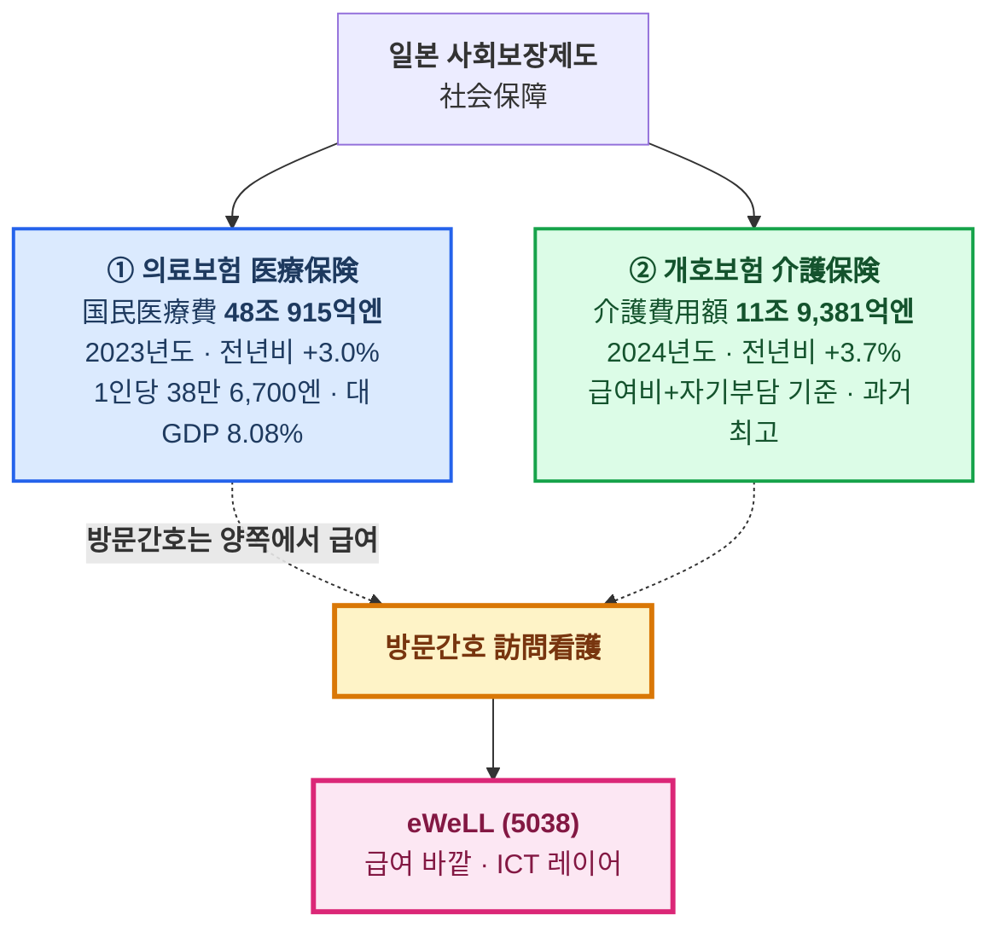
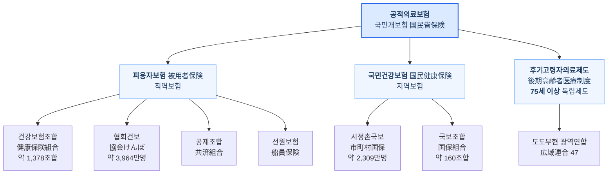
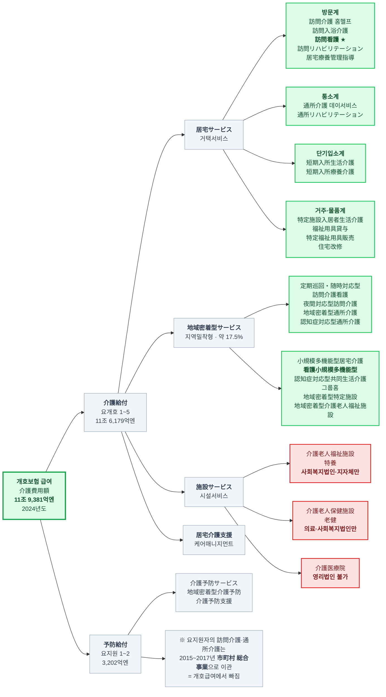
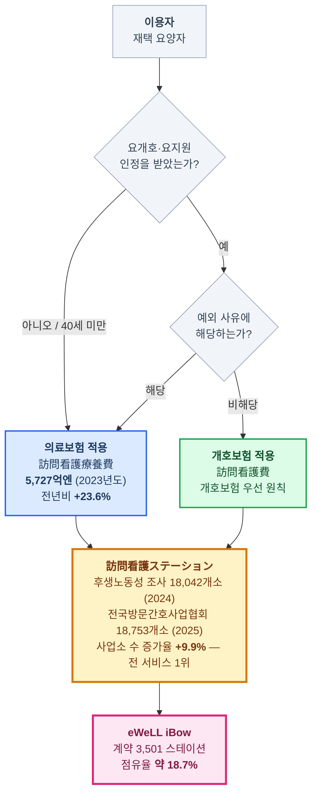
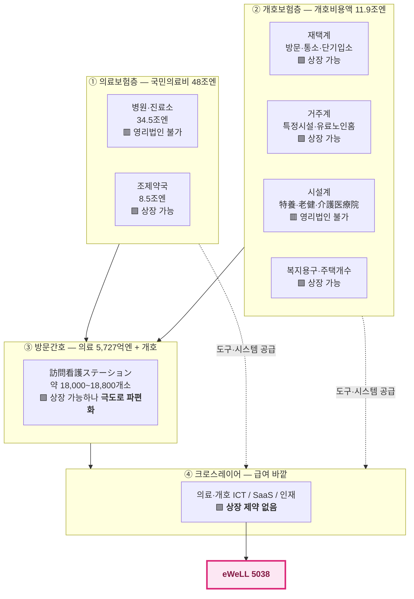

# 문서 1. 계층 구조 다이어그램 — 일본 의료에서 방문간호까지

> 조사 기준일: 2026-09-10
> 금액 단위는 모두 일본 원표기(億円·兆円). 정의 차이는 [문서 0](0_조사방법과_데이터_한계) 참조.

---

## 0. 시작하기 전에 — "개호보험 밑의 간호보험"은 없다

의뢰받은 표현은 "개호보험 밑의 간호보험"이었으나, **일본에는 `看護保険`이라는 별도 제도가 존재하지 않습니다.**

방문간호(訪問看護)는 제도상 **의료보험과 개호보험 양쪽에서 급여되는 이중구조**이며,
어느 쪽이 적용되는지는 **이용자의 상태와 연령이 결정**합니다(문서 하단 §4).

이 이중구조는 단순한 제도 트리비아가 아닙니다. **시장 규모를 반으로 착각하게 만드는 함정**입니다 —
개호보험 통계만 보면 방문간호 시장은 실제의 절반 이하로 보입니다.

---

## 1. 최상위 — 사회보장 2층 구조

**두 제도의 관계**: 요개호·요지원 인정을 받은 사람에게는 **개호보험이 우선 적용**됩니다(개호보험 우선 원칙).
의료보험이 나서는 것은 그 원칙의 **예외**에 해당할 때뿐입니다.

---

## 2. 의료보험 계층 (①)

### 2-1. 제도 계통

**자기부담률**: 미취학 2할 / 취학~69세 3할 / 70~74세 2할 / **75세 이상 1할**
(단 일정 이상 소득자 2할 — 2022년 10월 도입, 現役並み所得者 3할)

### 2-2. 국민의료비의 진료종류별 분해 — 여기서 방문간호가 처음 등장한다

**2023년도(令和5年度) · 총 48조 915억엔 · 신뢰도 A**

| 진료종류 | 금액 | 구성비 | 전년비 |
|---|---:|---:|---:|
| 의과진료 医科診療 | 34조 5,498억엔 | 71.8% | +2.1% |
| ┗ 입원 入院 | 17조 8,580억엔 | 37.1% | — |
| ┗ 외래 入院外 | 16조 6,918억엔 | 34.7% | — |
| 약국조제 薬局調剤 | 8조 4,563억엔 | 17.6% | +5.8% |
| 치과진료 歯科診療 | 3조 2,945억엔 | 6.9% | +2.1% |
| 입원시 식사·생활 | 7,437억엔 | 1.5% | +2.0% |
| **방문간호 訪問看護** | **5,727억엔** | **1.2%** | **+23.6%** ★ |
| 요양비 등 療養費等 | 4,744억엔 | 1.0% | +2.9% |

> **읽는 법**: 방문간호는 국민의료비의 **1.2%에 불과한 최소 항목**이지만,
> 증가율 **+23.6%**로 전체(+3.0%)의 **약 8배** 속도입니다. 규모가 작아서 빠른 게 아니라, 정책이 여기로 환자를 밀어넣고 있습니다.

**연령별 배분**: 65세 이상 28조 8,806억엔(**60.1%**) / 그중 75세 이상만 19조 1,503억엔(**39.8%**).
75세 이상 1인당 의료비는 95만 3,800엔으로 65세 미만(21만 8,000엔)의 **약 4.4배**.

---

## 3. 개호보험 계층 (②) — 급여 분류 MECE 전수

### 3-1. 제도의 뼈대

| 항목 | 내용 |
|---|---|
| 보험자 | 시정촌(市町村)·광역연합 |
| 피보험자 | 제1호 = 65세 이상 / 제2호 = 40~64세 |
| 재원 | 공비 50%(국가 25 : 도도부현 12.5 : 시정촌 12.5) + 보험료 50% |
| 제1호 보험료 | **월 6,225엔** (제9기 2024~2026년도 전국평균, 제8기 6,014엔 대비 +3.5%) |
| 자기부담 | 원칙 1할 (일정 소득 이상 2할·3할) |
| 인정구분 | 要支援 1~2 · 要介護 1~5 (7구분) |
| 인정자 수 | **723.3만명** (2024년 11월) — 제1호 피보험자의 **약 19.8%** |

**제1호 보험료 추이**: 1기 2,911 → 3기 4,090 → 5기 4,972 → 7기 5,869 → 8기 6,014 → **9기 6,225엔**

### 3-2. 급여 분류 전수 다이어그램

색상이 곧 **투자 가능성**입니다.
🟩 **초록 = 주식회사(영리법인) 개설 가능** / 🟥 **빨강 = 주식회사 개설 불가(법인격 규제)**

### 3-3. 개설주체 규제 — 상장률의 상한을 규정하는 법령

이 표가 **문서 4의 상장률이 왜 그 값인지**를 설명합니다.

| 서비스군 | 주식회사 개설 | 근거 |
|---|---|---|
| 居宅サービス 전반 (방문·통소·단기입소·복지용구) | **가능** | 介護保険法 제70조 — 지정 요건은 「법인일 것」뿐, 법인격 종류 무제한 |
| 特定施設入居者生活介護 / 有料老人ホーム | **가능** | 老人福祉法 제29조 신고제, 법인격 제한 없음 |
| サービス付き高齢者向け住宅 | **가능** | 高齢者住まい法 제5조 등록제 |
| 地域密着型サービス 대부분 | **가능** | 介護保険法 제78조의2 — 단 **시정촌 지정 + 정원 총량 통제** |
| 居宅介護支援 (케어매니) | **가능** | 介護保険法 제79조 |
| **介護老人福祉施設(特養)** | **불가** | 老人福祉法 — 지자체·사회복지법인만 |
| **介護老人保健施設(老健)** | **불가** | 介護保険法 — 지자체·의료법인·사회복지법인 등만 |
| **介護医療院** | **불가** | 동일 |
| **병원·진료소** *(의료보험층)* | **원칙 불가** | 医療法 제7조 제6항 — 영리 목적 개설에 허가를 주지 않을 수 있음 |
| **약국** *(의료보험층)* | **가능** | 薬機法 제4조 — 법인격 제한 없음 |

> **핵심**: 시설계는 법으로 상장기업의 진입 자체가 봉쇄돼 있습니다.
> 반면 재택계(방문·통소)와 거주계는 열려 있습니다. 이 규제선이 곧 투자 가능선입니다.

---

## 4. 최하위 — 방문간호(訪問看護)의 이중급여 구조

### 의료보험이 적용되는 "예외" — 실무상 매우 중요

| 유형 | 내용 |
|---|---|
| 연령 | **40세 미만** (개호보험 피보험자가 아님) |
| 인정 | 요개호·요지원 **미인정자** |
| 질병 | **厚生労働大臣が定める疾病等** (별표7) — 말기암, ALS, 다발성경화증 등 약 20종 |
| 지시서 | **특별방문간호지시서**가 발급된 급성 악화기 (월 1회·최대 14일 등) |
| 정신과 | **精神科訪問看護** — 별도 체계, 최근 급증 |

> **왜 의료보험 쪽이 훨씬 빠르게 성장하는가**: 말기암·난치병·정신과 등 **의료 의존도가 높은 케이스가 재택으로 이동**하고 있기 때문입니다.
> 개호보험 방문간호는 요개호자 증가에 비례해 완만히 늘지만, 의료보험 방문간호는 **병상 삭감·재택 임종(看取り) 정책의 직접적 수혜**를 받습니다.

---

## 5. 전체를 한 장으로

> **이 그림의 요점**: eWeLL은 급여 계층(①②③) 안에 있지 않습니다.
> **급여를 받는 사업자에게 도구를 파는 ④층**에 있고, 그 층만이 상장 제약에서 자유롭습니다.

---

[← 문서 0](0_조사방법과_데이터_한계) · [목록](index) · [다음: 계층별 대응 기업 →](2_계층별_대응기업)
