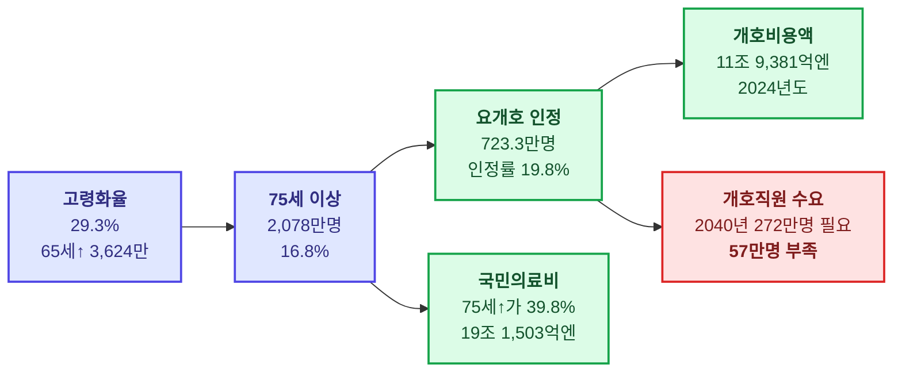

# 문서 3. 일본 고령화율 — 실적과 장래추계

> 조사 기준일: 2026-09-10
> 주요 출처: 내각부 「令和7年版 高齢社会白書」(2025년 6월 10일 공표), 총무성 통계국 「人口推計」,
> 국립사회보장·인구문제연구소 「日本の将来推計人口(令和5年推計)」

---

## 1. 최신 실적 — 고령화율 **29.3%**

**기준: 2024년(令和6년) 10월 1일 · 신뢰도 A (복수 독립 검색에서 재현 확인)**

| 항목 | 수치 | 총인구 대비 |
|---|---:|---:|
| **총인구** | **1억 2,380만명** | 100% |
| **65세 이상 인구 (고령자)** | **3,624만명** | **29.3%** ← 고령화율 |
| ┗ 남성 | 1,572만명 | — |
| ┗ 여성 | 2,053만명 | — |
| **65~74세 (전기고령자 前期高齢者)** | **1,547만명** | **12.5%** |
| **75세 이상 (후기고령자 後期高齢者)** | **2,078만명** | **16.8%** |

> **가장 중요한 한 줄**: **75세 이상(2,078만명)이 65~74세(1,547만명)를 이미 추월**했습니다.
> 일본의 고령자 인구는 "많아지는" 단계를 지나 **"더 늙어지는" 단계**에 들어섰습니다.

**전년 대비**: 2023년 10월 1일 기준 총인구 1억 2,435만명 · 고령화율 29.1% → **1년간 +0.2%p, 총인구는 55만명 감소**.

### 용어 혼동 주의

| 지표 | 정의 | 분모 |
|---|---|---|
| **고령화율 高齢化率** | 65세 이상 ÷ **총인구** | 총인구 |
| 노년인구지수 老年人口指数 | 65세 이상 ÷ **생산연령인구(15~64세)** | 생산연령인구 |

또한 "후기고령자 비율"은 분모를 **총인구**로 잡으면 16.8%, **65세 이상**으로 잡으면 57.3%입니다. 3배 이상 차이나므로 반드시 분모를 명시해야 합니다.

---

## 2. 시계열 실적 — 세계에서 가장 빠른 고령화

| 연도 | 고령화율 | 제도적 의미 | 등급 |
|---|---:|---|---|
| 1950 | 약 4.9% | 전후 기준점 | C |
| **1970** | **약 7.1%** | **「고령화사회」 진입 (7% 돌파)** | B |
| 1980 | 약 9.1% | — | C |
| 1990 | 약 12.1% | — | C |
| **1994** | **약 14.1%** | **「고령사회」 진입 (14% 돌파)** | B |
| 2000 | 약 17.4% | **개호보험 시행** | B |
| **2007** | **약 21.5%** | **「초고령사회」 진입 (21% 돌파)** | B |
| 2010 | 약 23.0% | — | C |
| 2015 | 약 26.6% | — | C |
| 2020 | **28.6%** | 국세조사 기준 | A |
| 2023 | **29.1%** | — | A |
| **2024** | **29.3%** | 최신 확정 | **A** |

**7% → 14%에 걸린 시간: 24년 (1970→1994).** 서구는 40~126년이 걸렸습니다. 이 속도가 일본 제도 설계의 모든 전제를 규정합니다.

> 다만 **일본은 이미 고령화 "속도" 1위 자리를 한국에 내줬습니다.** 일본이 세계 1위인 것은 고령화 **수준**입니다.
> (국가별 소요 연수는 자료마다 기점 정의가 달라 **C등급**으로만 제시합니다: 한국 약 18년, 독일 약 40년, 미국 약 72년, 프랑스 약 126년)

---

## 3. 장래추계 — 2070년까지

**출처: 국립사회보장·인구문제연구소 「日本の将来推計人口(令和5年推計)」 · 시나리오: 출생중위(出生中位)·사망중위(死亡中位)**

| 연도 | 총인구 | 고령화율 | 75세 이상 인구 | 75세↑ 비율 | 등급 |
|---|---:|---:|---:|---:|---|
| 2020 (실적) | 1억 2,615만 | **28.6%** | 약 1,860만 | 약 14.7% | A |
| 2024 (실적) | **1억 2,380만** | **29.3%** | **2,078만** | **16.8%** | **A** |
| 2040 | **1억 1,284만** | **약 34.8%** | **2,227만** | **약 20%** | **A** |
| 2070 | **8,700만** | **38.7%** | **2,180만** | **약 25%** | **A** |

- **2070년 = 2.6명 중 1명이 65세 이상, 약 4명 중 1명이 75세 이상** (백서 표현)
- 65세 이상 인구 자체의 피크는 **2043년경 약 3,953만명** (C등급)

### 반드시 짚어야 할 비대칭

**2040년 → 2070년 사이에 75세 이상 인구는 2,227만 → 2,180만으로 오히려 줄어듭니다.**
그런데 75세 이상 **비율**은 20% → 25%로 올라갑니다.

이유는 하나입니다 — **분모인 총인구가 1억 1,284만 → 8,700만으로 23% 무너지기 때문**입니다.

> 따라서 **개호 서비스의 절대 수요량은 2040년대에 정점을 치고, 그 이후는 비율만 오르고 물량은 줄어듭니다.**
> "고령화율이 계속 오르니 개호 시장도 계속 커진다"는 것은 **틀린 추론**입니다.
> 시장 규모를 보려면 고령화율이 아니라 **75세 이상·85세 이상의 절대수**를 봐야 합니다.

---

## 4. 고령화율이 시장으로 바뀌는 경로

**중간 계수 (신뢰도 A)**

| 계수 | 값 | 기준 |
|---|---:|---|
| 요개호(요지원) 인정자 수 | **723.3만명** | 2024년 11월 |
| 제1호 피보험자 대비 인정률 | **약 19.8%** | 동일 |
| 제1호 보험료 (제9기 전국평균) | **월 6,225엔** | 2024~2026년도 |
| ┗ 최고 / 최저 | 오사카시 9,249엔 / 오가사와라촌 3,374엔 | 2.7배 격차 |

**연령이 올라갈수록 인정률이 급등**합니다. 전체 평균은 19.8%이지만 85세 이상에서는 과반에 이릅니다.
따라서 개호 수요의 진짜 선행지표는 **85세 이상 인구**입니다. (2040년 1,000만명 초과 전망 — C등급, 정확한 값 미확보)

---

## 5. 2025년 문제와 2040년 문제 — 성격이 다르다

| | **2025년 문제** | **2040년 문제** |
|---|---|---|
| 정의 | 단카이세대(1947~49년생)가 **전원 75세 이상** 도달 | 단카이주니어(1971~74년생)가 65세 도달 + **생산연령인구 급감** |
| 성격 | **수요 급증** 문제 | **공급(인력) 붕괴** 문제 |
| 상태 | **이미 통과** (2025년) | 진행 중 |
| 정책 축 | 지역포괄케어시스템 구축 | 개호인력 확보·생산성 향상·DX |

### 개호직원 수급 — 2040년 문제의 실체 (신뢰도 A)

**출처: 후생노동성 2024년 7월 12일 공표 추계 (제9기 개호보험사업계획 기반, 도도부현 집계)**

| 시점 | 필요 인원 | 부족 | 필요 증원 |
|---|---:|---:|---|
| 2022년도 (실적) | **약 215만명** | — | — |
| 2026년도 | **약 240만명** | **약 25만명** | 연 약 3.2만명 |
| **2040년도** | **약 272만명** | **약 57만명** | **연 약 6.3만명** |

> **부족이 가장 심한 곳은 지방이 아니라 수도권**입니다 — 도쿄·가나가와·사이타마.
> 고령자 **절대수**가 급증하는 곳이 도시부이기 때문입니다.

### 지역 구조 — 비율과 절대수가 정반대를 가리킨다

| 지역 | 고령화율(비율) | 고령자 절대수 | 사업 함의 |
|---|---|---|---|
| 지방 현 (아키타·고치 등) | **매우 높음** (아키타 약 38~39%대, C등급) | 이미 정점 통과·감소 | 공급망 유지 곤란, 사업소 철수 리스크 |
| 도시부 (도쿄·오사카·가나가와) | **낮음** (도쿄 약 22~23%대, C등급) | **급증** | 시설·인력 절대 부족, 용지·인건비 제약 |

> **개호 시장의 성장분은 압도적으로 도시부에서 발생하고, 접근성·존속 문제는 지방에서 발생합니다.**
> 전국 단일 수치로 사업 기회를 판단하면 안 되는 이유입니다.

---

## 6. 이 문서가 eWeLL 조사에 갖는 의미

1. **고령화율(29.3%)은 이 산업의 배경일 뿐, 성장 드라이버가 아닙니다.** 드라이버는 **75세 이상 절대수(2,078만 → 2040년 2,227만)** 입니다.
2. **2040년대가 물량의 정점**입니다. 그 이후 개호 서비스 총량은 감소로 돌아섭니다. 15년짜리 순풍이지 영구 순풍이 아닙니다.
3. **인력 부족(2040년 57만명)이 최대 제약**입니다. 그리고 이것이 **eWeLL 같은 생산성 도구의 존재 이유**입니다 —
   사람을 늘릴 수 없다면 **1인당 처리량을 올리는 수밖에 없고**, 그것이 소프트웨어가 파는 가치입니다.
4. 즉 고령화는 **급여 계층(개호사업자)에게는 수요이자 동시에 인력난이라는 족쇄**이고,
   **ICT 계층에게는 순수한 순풍**입니다. 같은 인구 구조가 층에 따라 반대로 작동합니다.

---

[← 문서 2](2_계층별_대응기업) · [목록](index) · [다음: 상장률과 성장률 →](4_계층별_상장률과_성장률)
