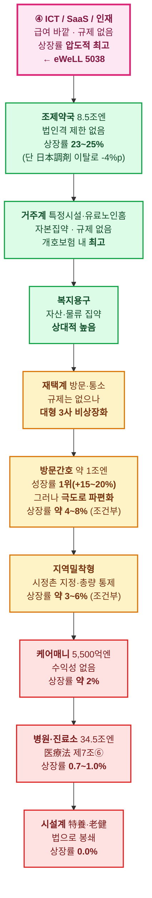

# 문서 4. 계층별 상장률과 시장 성장률

> 조사 기준일: 2026-09-10 · 금액 단위 億円
> **상장률 정의** = (해당 계층에서 **상장기업**이 올린 매출 합계) ÷ (해당 계층 **시장규모**) × 100
> 분모는 일관되게 **사업자 실수취액**(의료: 国民医療費 계열 / 개호: 介護費用額 = 급여비+자기부담) 기준. 이유는 [문서 0 §3-2](0_조사방법과_데이터_한계).

---

## 1. 답 요약

| 계층 | 시장규모 | 성장률 | **매출기준 상장률** | 등급 | 상장률을 결정한 요인 |
|---|---:|---:|---:|:--:|---|
| **병원·진료소** | 34조 5,498억엔 | +2.1% | **0.7~1.0%** | C | 医療法 제7조⑥ — **영리법인 개설 불가** |
| **조제약국** | 8조 4,563억엔 | **+5.8%** | **약 23~24%** (범위 19~26%) | B | 薬機法 — **법인격 제한 없음** |
| **방문간호** ★ | **약 1조엔** (도출) | **+15~20%** ★최고 | **약 4~8%** (조건부) | D | 개설 자유하나 **극도로 파편화** |
| 재택계 (방문개호·통소·단기입소) | 미산출 | +1.0%~0.0% (사업소 기준) | **낮음** (미산출) | D | 개설 자유하나 **대형 3사 비상장화** |
| 거주계 (특정시설·유료노인홈) | 미산출 | — | **개호보험 내 최고** (미산출) | D | 자본집약·규제 없음 |
| 지역밀착형 (그룹홈·소다기·간다기) | 미산출 | — | **약 3~6%** (조건부) | D | 시정촌 지정 + **정원 총량 통제** |
| **시설계 (特養·老健·介護医療院)** | 약 3.58조~3.82조엔 (추정) | 정체 | **0.0%** | **A** | **법으로 주식회사 개설 봉쇄** |
| 복지용구·주택개수 | 미산출 | — | **상대적 높음** (미산출) | D | 자산·물류 집약 |
| 거택개호지원 (케어매니) | 약 5,300~5,600억엔 | +2.0~2.8% | **약 3%** (범위 1.7~5.1%) | D | 개설 자유하나 **수익성 없음** |
| **ICT/SaaS·인재 (④층)** | — | 고성장 | **압도적 최고** | D | **규제 자체가 없음** |
| *(참고) 개호보험 전체* | **11조 9,381억엔** | **+3.7%** | — | A | — |
| *(참고) 의료보험 전체* | **48조 915억엔** | **+3.0%** | — | A | — |

> **⚠️ 정직한 고지**: 위 표의 "미산출"은 **이 조사 환경에서 데이터를 얻지 못했다**는 뜻이며,
> **"0%"와는 전혀 다릅니다**. 0%인 것은 시설계 하나뿐이고, 그것은 측정 결과가 아니라 **법령상 분자가 정의상 0**이기 때문입니다.
> 개호보험 서비스 종별 금액 분해표가 후생노동성 PDF 안에 있고 그 PDF에 접근할 수 없었습니다([문서 0 §1](0_조사방법과_데이터_한계)).
> **추정치로 빈칸을 메우지 않았습니다.** 방향성(높음/낮음)은 규제 구조와 확인된 기업 목록에서 도출한 것이며 수치가 아닙니다.

---

## 2. 시장 성장률 — 확인된 것

### 2-1. 최상위 두 제도

| 제도 | 기준 | 최신 | 성장률 | 등급 |
|---|---|---:|---:|---|
| 국민의료비 | 2023년도 | 48조 915억엔 | 전년비 **+3.0%** / 5년 CAGR **+2.08%** | A |
| 개호비용액 | 2024년도 | 11조 9,381억엔 | 전년비 **+3.7%** (+4,242억엔) | A |

*5년 CAGR 산출: 2018년도 43조 3,949억엔 → 2023년도 48조 915억엔, (480,915/433,949)^(1/5)−1 = +2.08%*

### 2-2. 진료종류별 성장률 — 방문간호의 압도적 1위 (2023년도, 신뢰도 A)

| 진료종류 | 전년비 | 전체(+3.0%) 대비 |
|---|---:|---|
| **訪問看護** | **+23.6%** | **약 8배** ★ |
| 薬局調剤 | +5.8% | 약 2배 |
| 療養費等 | +2.9% | 동등 |
| 医科診療 | +2.1% | 하회 |
| 歯科診療 | +2.1% | 하회 |
| 入院時食事·生活 | +2.0% | 하회 |

### 2-3. 사업소 수 증가율 — 여기서도 방문간호 1위 (令和6년 조사, 신뢰도 A)

| 서비스 | 사업소 수 | 증감 | 증가율 |
|---|---:|---:|---:|
| **訪問看護ステーション** | **18,042** | **+1,619** | **+9.9%** ★ |
| 訪問介護 | 37,264 | +359 | +1.0% |
| 通所介護 | 24,585 | +8 | **0.0%** |

> 全国訪問看護事業協会 조사로는 令和7년도 **18,753개소**(+1,424, 약 +8%). 조사주체가 다르므로 병기합니다.

**정기순회·수시대응형 방문개호간호**(간호가 들어가는 지역밀착형)도 수급자 48.83만 → **54.0만명(+10.6%)** 로 고성장입니다.

### 2-4. 방문간호 시장 규모 — 도출 (등급 C, 도출 과정 명시)

개호보험 통계만 보면 방문간호는 작아 보입니다. **의료보험분을 더해야 실제 규모가 나옵니다.**

| 연도 | 의료보험분 (訪問看護療養費) | 개호보험분 (訪問看護費) | **합계** |
|---|---:|---:|---:|
| 2019년도 | **2,727억엔** (A) | — | — |
| **2022년도** | **4,633억엔** (B) | **3,937억엔** (B) | **8,570억엔** (B) |
| **2023년도** | **5,727억엔** (A) | 약 4,100~4,300 (**도출**) | **약 9,800~1조엔** (**도출**) |

**도출 검산**: 4,633 × 1.236(2023년도 증가율 +23.6%) = **5,726** ≈ 공표치 **5,727**.
→ 8,570억엔 세트가 **2022년도(令和4년도)** 값임이 산술적으로 확정됩니다. 여기에 개호분 성장을 얹어 2023년도 총시장을 약 1조엔으로 도출했습니다.

**성장률**
- 의료보험분 4년 CAGR: (5,727/2,727)^(1/4)−1 = **+20.4%** (2019→2023) — 신뢰도 A
- 총시장 전년비: 8,570 → 약 9,900 = **약 +15%** — 도출

> **결론: 방문간호는 일본 의료·개호 전 세그먼트 중 성장률 1위입니다.** 금액 기준으로도, 사업소 수 기준으로도 그렇습니다.
> 그리고 그 성장의 대부분은 **개호보험이 아니라 의료보험 쪽에서** 나옵니다 — 말기암·난치병·정신과 등 의료의존도 높은 케이스의 재택 이행이 동력입니다.

---

## 3. 상장률 — 왜 이 값인가

### 3-1. 병원·진료소 = **0.7~1.0%**

```
상장률 = (상장사가 診療報酬를 직접 수취한 매출) ÷ (医科診療医療費 + 訪問看護医療費)
       = 약 2,450~3,700억엔 ÷ 약 351,500억엔 = 0.70~1.05%
```

**34.5조엔짜리 최대 시장인데 사실상 투자 불가능합니다.** 医療法 제7조 제6항이 영리 목적 개설을 막고 있어,
상장기업은 의료사무 수탁(ソラスト)·경영지원(CUC)·호스피스(アンビス) 같은 우회 경로로만 진입합니다.

### 3-2. 조제약국 = **약 23~25%** — 대조군

```
상장률 = 약 20,900억엔 ÷ 약 87,500억엔 = 약 23.9%
```

**같은 의료보험 안인데 병원(0.7~1.0%)과 약국(23~25%)이 30배 차이납니다.**
차이를 만든 것은 시장 매력도가 아니라 **법인격 규제 딱 하나**입니다.

> **그리고 이 25%마저 줄고 있습니다.** 日本調剤(3341, 조제 약 3,450억엔 규모)가 **2025년 12월 19일 상장폐지**되면서
> 상장률은 **약 28.9% → 24.9%로 약 4%p 증발**했습니다. 시장이 줄어서가 아니라 **투자 가능한 표면적이 줄어서** 입니다.

### 3-3. 시설계(特養·老健·介護医療院) = **0.0%** — 유일하게 신뢰도 A인 상장률

분자가 **정의상 0**입니다. 老人福祉法·介護保険法이 개설 주체를 지자체·사회복지법인·의료법인으로 한정하고 있어
**주식회사가 이 시장의 급여를 수취할 법적 경로가 존재하지 않습니다.**

상장기업은 급식·세탁·건설·인재파견 등 **조달 시장**에서만 관여하며, 이는 시설서비스 시장의 매출이 아닙니다.

### 3-4. 거택개호지원(케어매니) = **약 3%** (범위 1.7~5.1%)

```
하한  746 사업소 × 1,400만엔 =  104억엔 ÷ 6,200억엔 = 1.7%
중심  972 사업소 × 1,850만엔 =  180억엔 ÷ 5,700억엔 = 3.1%
상한 1,198 사업소 × 2,250만엔 =  270억엔 ÷ 5,300억엔 = 5.1%
```

> 상장계 사업소는 **特定事業所加算** 취득률과 상근 케어매니 배치가 전국평균보다 높아
> 사업소당 매출이 전국평균의 1.2~1.7배로 추정됩니다. 전국평균 단가를 그대로 쓰면 분자가 과소평가됩니다.

이 세그먼트는 **분모·분자 정의가 완전히 일치**하는 유일한 곳입니다 — 이용자 자기부담이 0이라 급여비 = 비용액 = 사업자 매출입니다.
상장률이 낮은 이유는 규제가 아니라 **수익성**입니다. 케어매니 사업소는 그 자체로 돈을 벌지 못하고, **고객 유입 게이트웨이**로 운영됩니다.

### 3-5. 재택계 — 상장률이 낮은 이유가 유일하게 "규제가 아닌" 계층

법적으로는 열려 있습니다. 그런데도 낮습니다. 이유는 **자발적 이탈**입니다.

| 사업자 | 지위 | 현재 |
|---|---|---|
| ニチイ学館 | 방문개호 최대급 | **비상장 (2020)** |
| ツクイHD | 데이서비스 최대급 | **비상장 (2021)** |
| セントケア・HD | 재택개호 대형 | **비상장 (2025.12)** |

남은 상장사는 ソラスト(연결 약 1,411억엔) · ケア21(2373, 10월기 3Q누계 359억엔) · シダー · ウチヤマHD · やまねメディカル 등으로,
**이탈한 3사보다 규모가 작습니다.**

> **왜 나가는가**: 개호보수는 3년 주기로 개정되고, 2024년도 개정에서는 訪問介護 기본보수가 **인하**됐습니다.
> 그 뒤 방문개호 사업자 도산이 급증했습니다. 이런 정책 변동을 분기 실적으로 공개하며 견디는 것보다,
> 비상장으로 내려가 장기 구조조정하는 편이 낫다는 판단이 반복되고 있습니다.

### 3-6. 거주계 — 상장률 계산이 구조적으로 왜곡되는 계층

**개호보험 안에서 상장기업 비중이 가장 높지만, 숫자를 그대로 믿으면 안 됩니다.**

기업 매출에는 **집세·식비·관리비 등 보험 바깥 수입**이 들어가는데 이는 어느 개호 통계에도 잡히지 않습니다.
분모를 特定施設 개호비용액으로 잡으면 상장률이 **3~4배 과대평가**됩니다.
올바른 분모는 「유료노인홈+사고주 운영 총매출」이지만, 그 통계는 존재하지 않습니다.

확인된 상장사: SOMPO HD(8630) · チャーム・ケア(6062, 466.73억엔) · 学研HD(9470) · リビングプラットフォーム(7091, 220.57억엔) · サンウェルズ(9229) 등.
최대급이던 **ベネッセスタイルケア는 비상장**입니다.

> 감사 단계에서 이 계층의 정량 추정(15~22%)이 산출됐으나 **인용 금지 판정**을 받았습니다 —
> 분모(유료노인홈+사고주 운영 총매출) 자체가 통계로 존재하지 않아 검증이 불가능하기 때문입니다. 방향성만 취하십시오.

### 3-7. 방문간호 — eWeLL의 시장

상장 개설이 자유롭고 성장률도 1위인데, **상장률은 약 4~8%(중심값 약 6%)** 에 그치는 것으로 추정됩니다.

```
분모  9,800~10,030억엔  = 의료보험측 5,727억엔(확인) + 개호보험측 약 4,100~4,300억엔(도출)
분자    430~830억엔     = 상장사 연결매출의 방문간호 귀속분(안분 추정)
결과  430/10,030 = 4.3%  ~  830/9,800 = 8.5%
```

> ⚠️ **반드시 주의할 계산 함정**: アンビスHD(491.74억엔)·CUC(543.53억엔)는 **연결 전체 매출**이지
> 방문간호 귀속 매출이 아닙니다. 두 회사 연결매출을 그대로 분자에 넣으면 10.5%,
> 분모를 의료보험분만으로 절단하면 18.1%가 나오지만 **둘 다 분자 과대 + 분모 절단의 산물**입니다.
> アンビス는 매출의 40~65%, CUC는 20~40% 정도가 방문간호 귀속으로 추정됩니다.

**독립 경로 검증**: 상장계열 운영 스테이션은 약 400~700개소로 추정되어 전국 18,753개소의 **2.1~3.7%**입니다.
매출점유(4~8%)가 사업소점유(2.1~3.7%)를 웃도는 것은 호스피스 병설·의료의존도 높은 케이스 중심의 **고단가 구조**와 정합합니다.
두 경로가 모순되지 않아 4~8%대는 최소한 자기무모순적입니다.

> ⚠️ 그럼에도 **확정치가 아닙니다.** 분모의 42~44%(개호보험측)가 미검증이고 분자는 전부 안분 가정입니다.
> 신뢰도 **very low** — "한 자릿수 %"라는 자릿수 판단까지만 신뢰하십시오.

낮은 이유는 **파편화**입니다. 약 18,000~18,800개 스테이션 대부분이 간호사 몇 명 규모의 비상장 중소사업자이고,
전국 체인이 사실상 없습니다.

> ⚠️ **진행 중 리스크**: 2026년 アンビスHD의 「医心館」 부정 진료보수 청구 의혹 보도로
> 日本ホスピスHD·CUC 주가가 동반 하락했습니다. 이 세그먼트의 상장 플레이어는 **규제 강화 리스크에 집중 노출**돼 있습니다.

---

## 4. 종합 — 상장률의 층서 구조



### 세 줄 결론

1. **상장률을 결정하는 것은 시장 매력도가 아니라 법인격 규제입니다.**
   같은 의료보험 안에서 병원 0.7~1.0% vs 약국 23~25%. 같은 개호보험 안에서 시설계 0% vs 거주계 최고. 차이는 전부 법령입니다.
2. **급여 계층의 투자 가능 표면적은 지금도 줄어들고 있습니다.**
   2020~2025년에 ニチイ학관·ツクイ·ベネッセ·日本調剤·セントケア가 차례로 시장을 떠났습니다.
   조제약국 상장률만 봐도 이 한 건(日本調剤)으로 4%p가 증발했습니다.
3. **성장률 1위 세그먼트(방문간호, +15~20%)와 상장 가능성이 만나는 지점은 급여 계층 안에 없습니다.**
   방문간호는 파편화돼 있어 사업자로서 규모를 잡기 어렵습니다.
   그 성장을 상장 주식으로 사는 유일한 경로는 **그들에게 도구를 파는 ④층**이며, eWeLL이 정확히 거기 있습니다.

---

[← 문서 3](3_고령화율) · [목록](index) · [다음: eWeLL 포지셔닝 →](5_eWeLL_포지셔닝)
