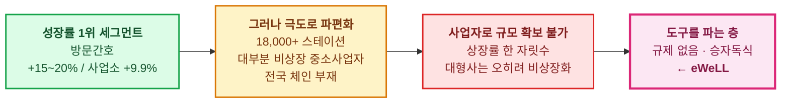

# 문서 5. eWeLL 포지셔닝 — 왜 이 층에 서 있는가

> 조사 기준일: 2026-09-10 · 금액 단위 億円 (**"billion yen"과 혼동 주의** — [문서 0 §3-1](0_조사방법과_데이터_한계))

---

## 1. 회사 개요

| 항목 | 내용 |
|---|---|
| 상호 | 株式会社eWeLL |
| 시장 | **東証グロース: 5038** |
| 결산기 | **12월기** |
| 본사 | 오사카 |
| 주력 | **iBow** — 방문간호(訪問看護) 특화 클라우드 전자기록 |

### 사업 구성

| 사업 | 내용 | 2024년기 매출 비중 |
|---|---|---:|
| **클라우드 서비스** | iBow (방문간호 전자기록 SaaS) | **약 88%** |
| **BPaaS** | iBow 事務管理代行 — 레세프트(청구) 사무 대행 | **약 10%** |
| 기타 | けあログっと(퇴원지원), iBow KINTAI 등 | 약 2% |

---

## 2. 실적 — 고성장 + 이례적 고수익성

| 항목 | 2024년 12월기 | **2025년 12월기** | 증감 | 등급 |
|---|---:|---:|---:|---|
| 매출 | 25.71 | **33.92** | **+31.9%** | A |
| 영업이익 | 11.35 | **15.37** | +35.4% | A |
| **영업이익률** | **44.2%** | **45.3%** | +1.1%p | A |
| 계약 스테이션 수 | — | **3,501** | 목표 초과 | A |

> **영업이익률 45%는 일본 SaaS 중에서도 최상위권**입니다. 그리고 30%대 성장과 45%대 이익률을 **동시에** 내고 있습니다.
> 통상 SaaS가 성장을 위해 이익률을 희생하는 것과 반대 패턴입니다.

**2025년 성장 동인**: AI 케어플랜·리포트 작성 기능의 침투, 그리고 **2025년부터 과금을 시작한 BPaaS**.
2026년 2월 13일 결산 발표와 함께 **신(新) 중기경영계획**을 공표했습니다(AI 서비스 침투 + 플랫폼 확대).

**직전 중기경영계획 목표** (참고): 2027년 매출 50.16 / 영업이익 22.50 / 스테이션 4,394 / 고객단가 104,200엔.
2025년 실적(33.92)은 이 궤도 위에 있습니다.

---

## 3. 점유율 — 분모에 따라 달라진다

| 분모 (전국 방문간호 스테이션 수) | 출처 | 점유율 |
|---|---|---:|
| **18,753개소** (令和7년도) | 全国訪問看護事業協会 | **18.7%** ← 회사 공시 기준 |
| **18,042개소** (令和6년 조사) | 후생노동성 介護サービス施設・事業所調査 | **19.4%** |

*3,501 ÷ 18,753 = 18.67% / 3,501 ÷ 18,042 = 19.40%*

**어느 쪽이든 방문간호 특화 SaaS에서 명확한 1위**입니다. 다만 **분모가 매년 8~10%씩 커지고 있어**,
점유율을 유지만 하려 해도 연 8~10%의 신규 획득이 필요합니다. 이 구조가 성장률의 하한이자 압박입니다.

### 경쟁 구도 — 두 개의 다른 싸움

| 시장 | 1위 | 2위 | 3위 | eWeLL |
|---|---|---|---|---|
| **개호소프트 전체** | ほのぼの (NDソフトウェア) | ワイズマン (도입 61,200+) | カイポケ (SMS 2175, 6,000+ 사업소) | 미진입 |
| **방문간호 특화** | **iBow (eWeLL) 약 18.7%** | 20개사 이상 난립 | — | **1위** |

> **eWeLL의 전략적 선택**: 개호 전반이 아니라 **방문간호 한 세그먼트에만** 특화했습니다.
> 대신 그 세그먼트에서 압도적 1위를 잡았습니다. 이것이 강점이자 동시에 리스크입니다(§5).

---

## 4. 왜 이 위치가 구조적으로 유리한가

이 조사 전체의 결론이 여기서 만납니다.

### 세 가지 순풍이 동시에 분다

1. **수요**: 75세 이상 2,078만명 → 2040년 2,227만명. 병상 삭감·재택 임종 정책이 환자를 재택으로 밀어냄
2. **인력난**: 2040년 개호직원 **57만명 부족**. 사람을 못 늘리면 **1인당 생산성을 올리는 수밖에 없음** = 소프트웨어 수요
3. **정책**: 의료·개호 DX 추진(전자카르테 정보공유, LIFE, 케어플랜 데이터 연계, ICT 도입 지원)

### 그리고 규제가 경쟁을 막아준다

eWeLL의 고객(방문간호 스테이션)은 **법인격 규제 없이 누구나 열 수 있어 계속 늘어납니다**(연 +8~10%).
동시에 그들은 **규모가 작아 자체 시스템을 개발할 수 없습니다**.
이 두 조건이 겹치는 한 표준 SaaS 수요는 구조적으로 유지됩니다.

> **역설**: 급여 계층의 상장을 막는 규제가, 그 위층 SaaS에게는 **파편화된 고객 기반을 영구 공급하는 장치**로 작동합니다.

---

## 5. 리스크 — 균형을 위해

| 리스크 | 내용 | 심각도 |
|---|---|---|
| **규제 강화 (진행 중)** | 2026년 アンビスHD 「医心館」 **부정 진료보수 청구 의혹** 보도 → 日本ホスピスHD·CUC 동반 하락. 방문간호·호스피스 전반에 감독 강화 압력. 스테이션 폐업이 늘면 **eWeLL의 고객 모수가 직접 줄어듦** | **높음** |
| **보수 개정** | 진료보수 2년·개호보수 3년 주기. 2024년도 訪問介護 인하 사례처럼 **방문간호도 인하될 수 있음**. 고객 지불여력에 직결 | 높음 |
| **성장률 1위의 지속성** | 訪問看護療養費 +23.6%(2023년도)는 이례적 고성장. 이 속도가 유지될 근거는 없음. 기저효과 반전 시 스테이션 증가율도 둔화 | 중간 |
| **대형 SaaS의 진입** | ほのぼの·ワイズマン·カイポケ가 방문간호 모듈을 본격 강화하면 정면 충돌. 이들은 개호 전반의 고객 기반을 이미 보유 | 중간 |
| **단일 세그먼트 의존** | 매출의 대부분이 방문간호 한 시장. けあログっと 등 인접 확장의 성공 여부가 분산의 관건 | 중간 |
| **점유율 유지 비용** | 분모가 연 8~10% 커져 **가만히 있으면 점유율이 떨어짐** | 중간 |
| **밸류에이션** | 시가총액·PER·PSR은 **이번 조사에서 확인하지 못함**. 성장·수익성은 확인됐으나 **가격이 적정한지는 이 조사가 답하지 못함** | **미확인** |

---

## 6. 결론

**eWeLL은 "일본 고령화에 투자한다"는 서사의 가장 깨끗한 구현체 중 하나입니다.**

- 일본 의료·개호에서 **가장 빠르게 성장하는 세그먼트**(방문간호, +15~20%)를 겨냥하고,
- 그 세그먼트를 **사업자로서 사는 것은 파편화 때문에 불가능**한데,
- **도구를 파는 층은 규제가 없어 상장이 자유롭고 승자독식**이며,
- eWeLL은 거기서 **점유율 18.7% 1위**에, **영업이익률 45%**, **매출 성장 +31.9%** 를 동시에 내고 있습니다.

**다만 이 조사가 답하지 못한 것이 둘 있습니다.**

1. **밸류에이션** — 사업의 질은 확인됐지만 **주가가 그것을 이미 반영했는지**는 확인하지 못했습니다.
2. **규제 이벤트의 전개** — 2026년 진행 중인 부정청구 의혹이 방문간호 전반의 감독 강화로 번질 경우,
   eWeLL의 고객 모수(스테이션 수) 자체가 타격받습니다. **이것이 가장 추적할 가치가 있는 변수**입니다.

> 스터디용 자료이며 투자 권유가 아닙니다.

---

[← 문서 4](4_계층별_상장률과_성장률) · [목록](index)
