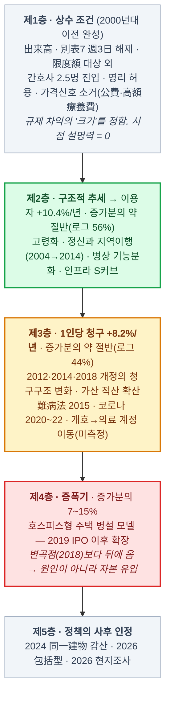

# 문서 6. 방문간호는 왜 혼자 성장했는가 — 수요·공급·제도·규제

> 조사 기준일: 2026-09-14 (개정판)
> 조사 구조: 1차 조사 7축 + 2차 조사 3축(sonnet) → 정량 검증 3건 + **인과 사슬 적대적 검토 1건(opus)**.
> **이 문서는 한 번 틀렸습니다.** 초판은 "제도 조건"을 원인으로 제시했고, 2차 가설은 "2013~2018년 사업모델이 방아쇠"라고 했습니다. 검토에서 둘 다 부분 기각됐습니다. 아래는 기각 사유와 수정된 답입니다. 출처 등급은 [문서 8](8_성장_수치의_출처와_신뢰성).

---

## 0. 한 줄 답 (수정판)

**방문간호(의료보험분)는 2013년부터 2023년까지 10년 내내 연 +18%로 자랐고, 그 증가는 "이용자가 늘어서"(연 +10%)와 "이용자 1인당 청구액이 늘어서"(연 +8%)가 대략 반반입니다** (로그 기여 56:44, 교차항을 단가 쪽에 붙이면 45:55).
1인당 청구액 상승은 보수 단가 인상 때문이 아닙니다(5년 누적 2% 미만). **방문 빈도·복수명·가산의 적산과 중증 케이스 구성 변화** 때문이고, 그것이 가능했던 이유는 出来高·한도액 대상 외·주 3일 해제라는 **상수 조건** 위에 2012·2014·2018년 개정이 청구 구조를 바꿔 놓았기 때문입니다.
호스피스형 주택 모델은 이 흐름의 **원인이 아니라 가장 눈에 띄는 증폭기(증가분의 7~15%)** 이고, 정신과 방문간호는 전체와 같은 속도로 자란 **동행 항목**입니다.

---

## 1. 무엇을 설명해야 하는가 — 설명 대상부터 틀렸다

### 1-1. "급성장"이 아니라 "10년 지수성장"

| 연도 | 訪問看護医療費 | 구간 CAGR | 등급 |
|---|---:|---:|---|
| 2013년도 | 1,086억엔 | — | A |
| 2015년도 | 1,485억엔 | 2013→15 **+16.9%** | A |
| 2018년도 | 2,355억엔 | 2015→18 **+16.6%** | A |
| 2023년도 | 5,727억엔 | 2018→23 **+19.5%** | A |
| 2013→2023 | ×5.3 | **+18.1%** | A |

> **검토의 첫 번째 지적**: 2015년 이전에도 이미 연 +17%였습니다. "2015년 이후 가속"은 존재하지 않고, 2018년 이후 **+2.9%p**의 소폭 가속이 있을 뿐입니다.
> 초판은 "연 20% 성장 전체"를 설명하려고 방아쇠를 찾았지만, 방아쇠가 설명해야 할 것은 그 +2.9%p뿐입니다. **설명 대상을 약 7배 과대 설정한 것**이 최대 결함이었습니다.

### 1-2. 성장의 항등식 — 실측 분해 (등급 A~B)

訪問看護医療費 = 스테이션 수 × 스테이션당 이용자 × 이용자당 연간 청구액

| 항 | 연율 | 근거 |
|---|---:|---|
| 스테이션 수 | **+7.6%** | 2010→2025 약 3배 (협회) |
| 스테이션당 이용자 | **+2.6%** | 잔차 (사실상 정체) |
| 이용자 수 | **+10.4%** | 49,425명(2011) → 161,442명(2023), 療養費実態調査 |
| **이용자당 청구액** | **+8.2%** | 잔차 |
| **합계** | **+19.5%** | 1.076 × 1.026 × 1.082 = 1.195 ✓ |

**증가분 3,372억엔(2018→2023)의 요인 분해**

| 요인 | 금액 | 비중 |
|---|---:|---:|
| 이용자 수 효과 (단가 고정) | 1,501억엔 | 44.5% |
| 1인당 청구액 효과 (이용자 고정) | 1,142억엔 | 33.9% |
| 교차항 | 728억엔 | 21.6% |
| *로그 기여로 나누면* | 이용자 **55.7%** : 1인당 **44.3%** | 교차항 귀속에 따라 45:55 ~ 56:44 |

**1인당 청구액 수준**: 2018년 월 약 19.9만엔 → 2023년 월 약 29.6만엔 (**×1.485**). 정신과 週3回 30분 기준선(월 6.66만엔)의 **약 4.4배**를 평균 이용자가 청구받고 있습니다.
같은 기간 診療報酬 본체 개정률 누적은 2018 +0.55%, 2020 +0.55%, 2022 +0.43% = **5년 2% 미만**. 즉 **×1.485 중 단가표 인상이 설명하는 몫은 거의 0**이고, 나머지 전부가 서비스량(방문 빈도 × 복수명 × 가산)과 케이스 구성 변화입니다.

> **여기가 전장(戰場)입니다.** "왜 성장했는가"의 절반 안팎은 이용자 수(구조적), 나머지는 **1인당 청구 8%/년**이며, 후자의 정체를 밝히는 것이 이 문서의 일입니다.
>
> 또 하나의 경고: 1인당 청구 **절대수준**(월 29.6만엔)은 현장 실감(월 10~15만엔)의 2배로, 분모 161,442명이 월간 스냅샷일 가능성이 큽니다. 이 문서는 **증가율만** 쓰고 수준은 쓰지 않습니다.

---

## 2. 수정된 인과 사슬 — 5층 구조

### 초판·2차 가설과 무엇이 달라졌나

| 항목 | 초판 / 2차 가설 | 검토 후 |
|---|---|---|
| 설명 대상 | "2015년 이후 연 20% 급성장" | **2013년부터 연 17~19% 지속.** 가속은 +2.9%p뿐 |
| 제도 조건(限度額·別表7·出来高) | "성장 동인" | **상수 조건.** 차익의 크기를 정할 뿐 시점을 설명 못함 |
| 정신과 방문간호 | "최대 동인" | **동행 항목.** 성장률 +18.8%/년 = 전체 +18.4%. 구성비를 안 바꿈 |
| 호스피스형 주택 모델 | "2018~2023 방아쇠" | **증폭기.** 2019년 이후 확장 = 변곡점 이후. 상장 4사 = 증가분의 7~15% |
| 이용자 +10% = 절반 | 유지 | **산술로 확인 (44.5%)** — 유일하게 온전히 살아남은 고리 |
| 2018년 변곡점의 원인 | (없음) | **精神科訪問看護基本療養費(Ⅱ) 폐지** (2018.4) — 청구 단위 분해 효과. 신설 고리 |

---

## 3. 제1층 — 상수 조건: 왜 차익이 "컸는가"는 설명하지만 "언제"는 못한다

[문서 7](7_의료보험_자금흐름과_방문간호의_위치) §6~§8의 규정들입니다. 각각의 성립 시점을 붙이면 왜 원인이 될 수 없는지 보입니다.

| 조건 | 성립 시점 | 역할 |
|---|---|---|
| 出来高払い (행위별 수가, 가산 무제한 적산) | 제도 발족(1994) 이래 | 청구에 천장이 없음 |
| 別表7 — 週4日 이상·1日 복수회·3개소 병용 | 현행 고시 2008년, 원형 1994년 | 중증자에게 무제한 |
| 区分支給限度額 대상 외 | 2000년 개호보험 시행 | 개호 한도의 압박이 없음 |
| 간호사 상근환산 2.5명 개설 요건 | 2000년 | 진입 장벽 최저 |
| 영리법인 개설 허용 | 1992년 노인방문간호 / 2000년 | 자본 유입 가능 |
| 自立支援医療 1할 | 2006년 障害者自立支援法 | 정신과 이용자 가격신호 소거 |
| 生活保護 医療扶助 0円 / 高額療養費 | 1950년 / 1973년 | 가격신호 소거 |

> 초판이 "증폭기"라 부른 곱셈 구조(가격신호 0 × 상한 없음 × 진입 자유)는 실은 이 층입니다. **상수는 변화율을 만들 수 없습니다.** 이 층은 "일단 누군가 발굴하면 얼마나 크게 남용할 수 있는가"를 정합니다.

---

## 4. 제2층 — 구조적 추세: 이용자 +10.4%/년, 증가분의 45%

| 동인 | 내용 | 등급 |
|---|---|---|
| 고령화 | 75세 이상 2,078만명(2024), 계속 증가 | A |
| 정신과 지역이행 | 2004 改革ビジョン → 2014 精神保健福祉法 개정 시행. 5년 이상 장기입원자 대폭 감소. 정신병상 316,147床(2024) | A/B |
| 병상 기능분화 | 地域医療構想(2016~). 다만 실적 삭감은 수% | B |
| 인프라 S커브 | 스테이션 2010→2025 약 3배, 연 +7.6% | B |
| 결과 | 의료보험 이용자 49,425명(2011) → 161,442명(2023), **연 +10.4%** | B |

이 층은 초판·2차 가설·검토 모두에서 살아남았습니다. **"이용자가 늘어서"는 맞고, 절반입니다.**

---

## 5. 제3층 — 1인당 청구 +8.2%/년, 증가분의 55%: 진짜 전장

### 5-1. 청구 구조를 바꾼 개정 (등급 B) — 검토가 새로 세운 고리

| 개정 | 내용 | 효과 |
|---|---|---|
| **2012년도** | 퇴원 후 3개월 이내 정신과 방문간호 **週5回** 산정 가능 | 빈회화의 문을 엶 (2013년 변곡 직전) |
| **2014년도** | **機能強化型訪問看護管理療養費** 신설 | 대형화·24시간·터미널에 가산. 1인당 단가 상승의 유력 후보 |
| **2018년도** | **精神科訪問看護基本療養費(Ⅱ) 폐지** — 시설 입소자 복수명 동시방문의 일괄 산정(1,600円)을 폐지하고 **개별 산정**으로 전환 | **같은 서비스량이라도 청구액이 구조적으로 증가.** 시행 2018년 4월 = 실측 변곡점과 정확히 일치 |

> 2차 가설은 2018년 변곡을 "정신과 체인의 스케일"로 읽었지만, 검토는 **청구 단위 분해라는 회계적 효과**가 더 단순한 설명이라고 봅니다. 서비스가 늘어서가 아니라 **세는 방법이 바뀌어서** 금액이 뛴 부분이 있다는 뜻입니다.

### 5-2. 가산 취득률의 광범위한 상승 (등급 C)

24時間対応体制加算·特別管理加算·複数名訪問看護加算·長時間訪問看護加算·ターミナルケア療養費. 단가표 인상이 2% 미만인데 1인당이 ×1.485이므로, **나머지 48%p는 전량 이 가산들의 적산과 방문 빈도**입니다. 이것은 호스피스형 주택 바깥의 **일반 스테이션에서도 작동**합니다 — 그래서 상장 4사가 증가분의 10%밖에 설명하지 못하는 것입니다.

### 5-3. 대상자 풀의 정책적 확대 (등급 C)

難病法(2015년 1월, 지정난치병 대폭 확대), 医療的ケア児支援法(2021년) → 別表7·8 해당자 증가. 2차 가설이 누락한 요인.

### 5-4. 코로나 (2020~2022, 등급 C)

입원 기피·면회 제한·조기 퇴원·재택 발열 대응. 관찰기간 5년 중 3년. 2020년도에 국민의료비 전체 −3.2%인데 방문간호 +19.3%였던 것은 "영향 없음"이 아니라 **반대 부호로 작용**한 것입니다.

### 5-5. 개호→의료 계정 이동 (등급 D, 미측정)

別表7·특별지시서로 개호보험 방문간호가 의료보험으로 옮겨 가면, **총량 불변인데 의료보험분만 늘어나는 착시**가 생깁니다. 개호측 금액 계열을 확보하지 못해 이 몫은 분리하지 못했습니다.

---

## 6. 제4층 — 증폭기: 호스피스형 주택 모델은 원인이 아니라 자본 유입이다

### 6-1. 모델의 구조 (등급 B)

住宅型有料老人ホーム·サ高住로 등록(**特定施設 미지정** → 개호 시설급여의 정액·총량 규제를 안 받음) + 병설 訪問看護ステーション + 병설 訪問介護. 입주자가 別表7(末期がん·**パーキンソン病 Yahr3 이상**·ALS 등)이면 의료보험 방문간호에서 週3日 해제·1日 복수회·複数名·24時間·ターミナルケア를 적산. **"재택 의료보험 단가로 시설급 서비스를 出来高로 청구"** 하는 규제 차익.

### 6-2. 타임라인과 규모 (등급 B/C)

| 기업 | IPO | 시설 수 |
|---|---|---|
| アンビスHD (7071, 医心館) | **2019** (JASDAQ) | 19(2019) → **130**(2025.9) |
| 日本ホスピスHD (7061) | **2019.3** (마더스) | 12(2019) → 33(2023) → 50 목표(2024) |
| サンウェルズ (9229, PDハウス) | 2022경 (그로스) | 12(2022.3) → 20(2023.3) |
| シーユーシー (9158, CUCホスピス) | 2023경 | 37시설·89거점(2023.9) → 63거점(2026.3) |

1인당 월 청구: 医心館 개정 전 **월 80~90만엔**까지 가능했다는 보도(3차). サンウェルズ 특별조사위: 매출 목표가 **1일 3회·복수명 방문 없이는 달성 불가**한 수준.

### 6-3. 검토의 정정 세 가지

1. **시점**: 이 확장은 2019~2024년 — **2018년 변곡점보다 뒤**입니다. 원인은 결과에 선행해야 합니다. 이것은 "모델이 총액을 밀어올린" 것이 아니라 **"이미 가속 중인 시장에 자본이 들어온"** 것입니다.
2. **규모**: 상장 4사의 의료보험 방문간호 매출은 2023년 약 400~600억엔 = 전체의 7~10%, 2018→2023 증가분 3,372억엔의 **약 7~15%(중앙 10%)**. サンウェルズ 부정청구 28.47억엔은 증가분의 0.84%. "실질 주역"이 되려면 비상장 모방 사업자까지 포함해 15~30%가 돼야 하는데 **그 규모는 미측정**입니다.
3. **집중의 정황**: 연간 청구 **2.5억엔 이상 초고액 스테이션 수가 2018→2023년 +1,280%** (1,500만엔 미만 통상 스테이션은 +122%) — 소수의 초고액 사업자군이 증가분에서 불균형하게 큰 몫을 차지했다는 신호입니다. 다만 이것이 "병설형"과 동일 집단인지는 미확인.

> **결론**: 호스피스형 주택 모델은 실재하고 병리도 실재합니다. 하지만 **"병리의 존재"와 "총액 성장의 동인"은 별개**입니다. 이 모델은 10년 지수성장의 원인이 아니라, 그 성장의 가장 가시적이고 가장 규제받기 쉬운 10%입니다.

---

## 7. 정신과 방문간호 — "최대 동인"에서 "동행 항목"으로

| 확인된 것 | 값 | 등급 |
|---|---|---|
| 公費 정신과 방문간호 이용건수 | 2015→2025년도 **5.6배** = **연 +18.8%** | C |
| 전체 訪問看護医療費 | 2015→2023 **연 +18.4%** | A |
| N・フィールド | 2013 마더스 → 2015 東証1部 → **2021.6 상장폐지**(Unison TOB 약 155억엔). 213거점 | A |
| 후속 체인 デューン | 47도도부현 220개소+ (시점 불명) | C |
| 이용자 진단 | 統合失調症 계열 75.4% | B |

> **검토의 판정**: 정신과 부문은 전체와 **같은 속도**로 자랐습니다. 평균과 같은 속도로 자란 항목은 구성비를 바꾸지 않으므로 평균을 끌어올릴 수 없습니다. 그리고 N・フィールド의 스케일 단계(2013~2015)는 관찰기간에 **선행**합니다.
> 정신과는 "가속의 원인"이 아니라 **"가속을 동반한 동행 항목"** 입니다. 2차 가설의 모델 2는 기각됩니다.
> 다만 2018년 精神科Ⅱ 폐지(§5-1)를 통해 정신과는 **청구 구조 변화의 경로**로는 여전히 관여합니다.

---

## 8. 대조군 — 왜 訪問介護·通所介護는 정체인가 (검증자 정정 반영)

| 서비스 | 사업소 증감 (2024) | 확인된 사정 |
|---|---:|---|
| **訪問看護** | **+9.9%** | 위 §3~§7 |
| 訪問介護 | +1.0% | 2024년도 기본보수 −2.3%. 도산 2022년도 144 → 2023 131 → **2024 179건(역대 최다)**. 헬퍼 有効求人倍率 15배 전후 |
| 通所介護 | 0.0% | 2016년도 소규모 사업소의 地域密着型 강제 이관, 코로나 이용 억제 |
| 地域密着型通所介護 | −1.2% | 동일 + 시정촌 총량 |
| 訪問入浴介護 | 축소 | 사업소 전무 시정촌 63%(1,112) |

**검증자가 바로잡은 세 가지**
1. **시점 역전**: 訪問介護 정체를 2024년 보수 인하 탓으로 돌리는 것은 무리. 사업소 횡보와 도산 증가는 2022년부터. **선행 요인은 헬퍼 고령화·구인난.**
2. **전산업 공통 요인**: 2023년도 도산 감소는 ゼロゼロ융자 이연 효과, 2024년도 급증은 상환 반동일 가능성. 개호 고유 요인은 전산업 대비 초과분으로 봐야 함(미실시).
3. **절대 건수 vs 도산율**: 訪問介護 도산 86건 = 모집단 37,264의 **0.23%**. 사업소는 **+1.0% 순증**. 축소가 아니라 **재편**.

> 訪問介護·通所介護의 정체는 訪問看護 성장과 연동된 것이 아니라 각각 독립적 원인(인력 고갈 / 총량 재편 / 수요 축소)입니다.
> 그리고 결정적 차이 하나: **訪問介護는 개호보험에만 있어 限度額 안에 갇히고, 헬퍼는 고갈됐습니다.** 訪問看護는 의료보험이라는 한도 없는 출구가 있고, 간호사는 아직 있습니다.

---

## 9. 제5층 — 규제의 반격: 정책이 사후에 인정한 메커니즘

| 시점 | 조치 | 겨냥 |
|---|---|---|
| 2018년도 | 精神科基本療養費(Ⅱ) 폐지 | (의도치 않게 청구액을 늘림 — §5-1) |
| 2024년도 | 管理療養費 1/2 분할, 同一建物 7할 요건, GAF≤40, 정신과 30분 미만 제한 | 집합주택 편중·경증 정신과 빈회 |
| 2025.2 | サンウェルズ 특별조사위 — 부정청구 약 28.47억엔, 방문시간 과대 171,546건 | 병설 모델 |
| 2026.1~ | 厚労省 **전국일제 현지조사** (방문간호 사상 최초, 健康保険法) | 호스피스형 주택·정신과 스테이션 |
| **2026.6** | **包括型訪問看護療養費** — 병설 스테이션 하루당 정액 7,010~15,510円. 基本療養費(Ⅱ) 同一建物 5구분·週→月 전환 | 出来高의 천장 |
| 2026.7 | 日経: 公費 정신과 5.6배 → 厚労省 실태조사 | 정신과 |

> 厚労省·업계 설명은 **"出来高払い 하에서 보수가 불균형하게 높아지는 구조"** 를 개정 이유로 명시합니다. 이것은 제1층(상수 조건)과 제4층(병설 모델)의 결합이 실재했다는 **정책 당국의 사후 인정**입니다.
> 단, 2026년 개정은 병설형(제4층)만 겨냥하고 **일반 스테이션의 가산 적산(제3층 5-2)에는 손대지 않습니다.** 따라서 **2026년 이후에도 증가율이 크게 떨어지지 않으면, 성장의 본체가 병설형이 아니라 일반 스테이션의 1인당 청구 상승이었다는 이 문서의 판정이 확증됩니다.** 반대로 크게 떨어지면 검토의 "증폭기 10%" 추정이 과소였던 것입니다.

---

## 10. 종합 — "왜 성장했는가"의 답

1. **10년 동안 연 18%로 자랐다.** 급성장이 아니라 지수성장이고, 2015년이든 2018년이든 변곡점이라 부를 만한 것은 +2.9%p뿐이다.
2. **절반(45%)은 이용자가 늘어서다.** 고령화·정신과 지역이행·병상 기능분화·스테이션 보급이 이용자를 연 +10% 늘렸다. 이것은 구조적이고 정당하다.
3. **절반(55%)은 이용자 1인당 청구가 연 +8% 늘어서다.** 단가표 인상은 5년 2% 미만이므로, 이는 **방문 빈도·복수명·가산의 적산과 중증 케이스 구성 변화**다. 2012·2014·2018년 개정이 청구 구조를 바꿨고, 出来高·한도 없음·주 3일 해제라는 상수 조건이 그 적산에 천장을 두지 않았다.
4. **호스피스형 주택 모델은 그중 7~15%다.** 2019년 이후 자본이 들어와 가장 눈에 띄는 병리를 만들었지만, 원인은 아니다. 규제(2024·2026)는 이 10%를 겨냥한다.
5. **정신과는 동행 항목이다.** 전체와 같은 속도로 자랐다.
6. **답하지 못한 것**: 1인당 +8% 중 개호→의료 계정 이동이 차지하는 몫, 가산별 기여율, 비상장 병설형 전체 규모. 셋 다 e-Stat·中医協 원표 안에 있다.

### eWeLL에 갖는 의미

- eWeLL의 고객 모수(스테이션 연 +7.6%)를 키운 것은 제1층의 자유 진입과 제2층의 구조적 수요. **규제 대상이 아니다.**
- eWeLL의 고객 단가·BPaaS 수요를 키운 것은 제3층의 **청구 복잡성**(가산 적산·이중 청구). 규제가 복잡해질수록 오히려 늘 수 있다.
- **리스크는 제4·5층**: 현지조사가 병설형 스테이션 폐업으로 이어지면 고객 모수가 줄고, 그 고객은 청구 건수가 많은 고단가 고객일 가능성이 높다. 노출도는 회사 공시로 확인 불가.

---

## 11. 반증 조건 — 이 판정이 틀렸다고 보게 될 데이터

| 조건 | 판정 |
|---|---|
| 2026년도 개정(병설형 정액화) 이후 訪問看護医療費 증가율이 **한 자릿수로 급락** | 병설형이 10%가 아니라 주역이었다 → 검토의 규모 추정 과소 |
| 개호보험 訪問看護 금액이 같은 기간 **감소 또는 정체** | 개호→의료 계정 이동이 컸다 → 총시장 성장은 착시 |
| 訪問看護療養費実態調査에서 1인당 방문 횟수가 **정체**하고 가산 취득률만 상승 | 성장은 "빈도"가 아니라 "가산 코딩" |
| 초고액 스테이션(2.5억엔↑) 집단이 증가분의 **30% 이상** | 집중 가설 강화, 검토의 "일반 스테이션 확산" 약화 |

---

[← 문서 5](5_eWeLL_포지셔닝) · [목록](index) · [다음: 자금 흐름 다이어그램 →](7_의료보험_자금흐름과_방문간호의_위치)
