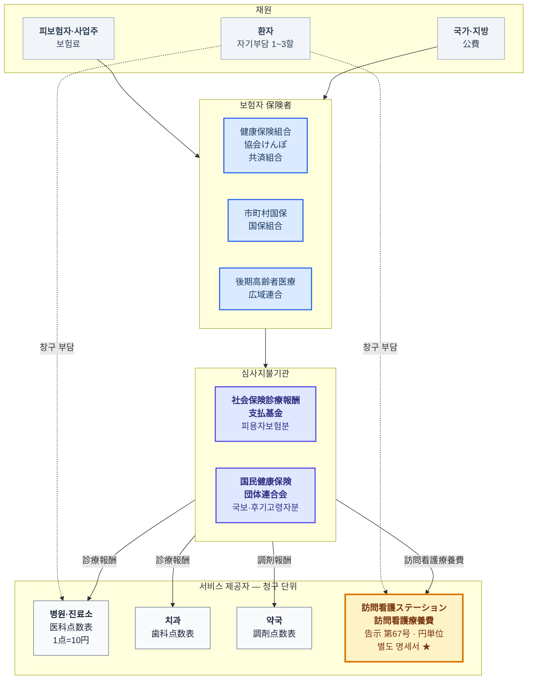
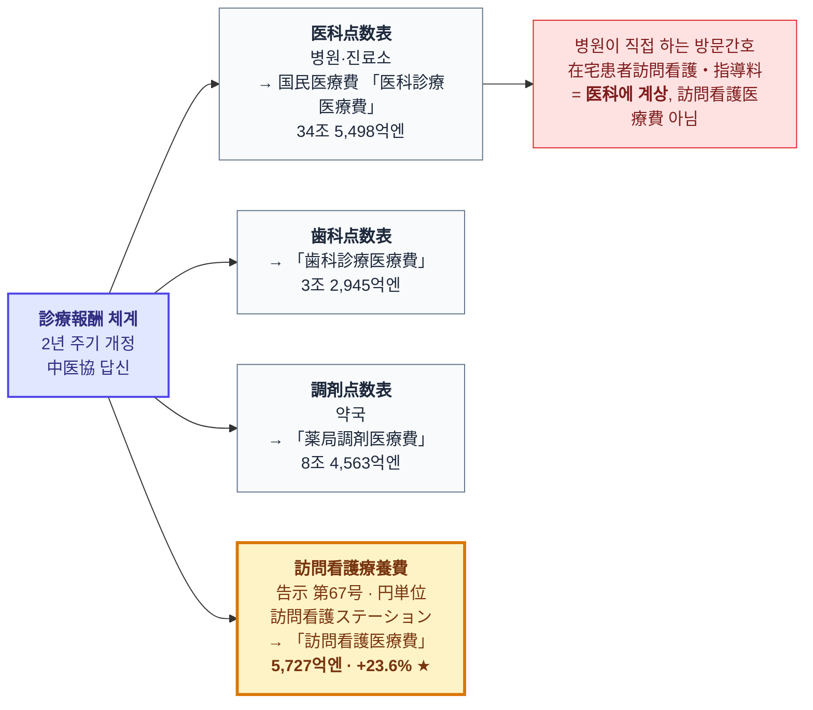
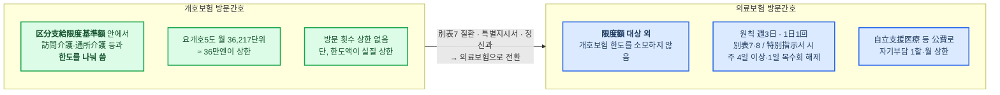
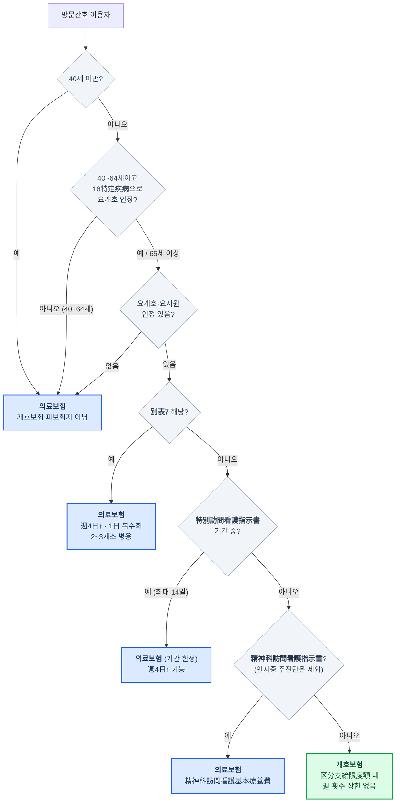

# 문서 7. 의료보험 자금 흐름 다이어그램 — 방문간호는 어디에 있는가

> 조사 기준일: 2026-09-13
> [문서 1](1_계층구조_다이어그램) §2가 "누가 보험자인가"(제도 계통)를 그렸다면, 이 문서는 **"돈이 어디로 흐르고, 어느 보수표로 값이 매겨지는가"** 를 그립니다.
> 방문간호의 위치는 이 층위에서 봐야 정확히 보입니다.

---

## 1. 한 장 요약 — 방문간호는 診療報酬点数表 바깥에 있다

일본 의료보험의 급여는 대부분 **診療報酬点数表**(1点=10円)로 값이 매겨집니다.
그런데 **訪問看護ステーション이 청구하는 訪問看護療養費는 이 점수표에 없습니다.**
별도 告示(厚生労働省告示 第67号, 平成20년 3월 5일 「訪問看護療養費に係る指定訪問看護の費用の額の算定方法」)로 **円 단위**로 정해지고,
**별도 청구서(訪問看護療養費明細書)** 로 청구됩니다.

같은 "방문간호"라도 **병원·진료소가 직접 하는 것**(みなし指定)은 医科点数表의 「在宅患者訪問看護・指導料」로 청구되어 **医科診療医療費**에 잡히고,
**스테이션이 하는 것**은 訪問看護療養費로 청구되어 국민의료비의 **「訪問看護医療費」** 에 잡힙니다.

> 즉 우리가 "+23.6%"라고 부른 그 수치는 **스테이션이 의료보험에 청구한 금액만**입니다.
> 병원 방문간호도, 개호보험 방문간호도 들어 있지 않습니다. 이 정의를 놓치면 시장 규모와 성장률을 모두 잘못 읽습니다.

---

## 2. 자금 흐름 전체도

### 읽는 법

| 단계 | 내용 |
|---|---|
| 재원 | 보험료 약 50% + 公費 약 37.5% + 환자부담 약 12% (2023년도 국민의료비 재원 구성, [문서 1](1_계층구조_다이어그램)) |
| 보험자 | 3계통. 75세 이상은 後期高齢者医療広域連合으로 이관. 訪問看護 이용자의 다수가 이 계통 |
| 심사지불기관 | 청구서(レセプト)를 심사하고 지불. 스테이션은 피용자보험분은 支払基金, 국보·후기고령자분은 国保連에 청구 |
| 제공자 | **네 개의 서로 다른 보수표**. 스테이션만 円 단위 告示 |

---

## 3. 보수체계 안에서의 위치 — 네 갈래 중 하나

*금액은 2023년도(令和5年度) 국민의료비, 신뢰도 A.*

### 訪問看護療養費의 실제 단가 (2024년 6월 개정 기준, 円)

| 항목 | 금액 | 비고 |
|---|---:|---|
| 訪問看護基本療養費(Ⅰ) 30分以上 | **5,550円/일** | 週3日까지 원칙 |
| 精神科訪問看護基本療養費 30分未満 | 4,250円/일 | 정신과 단시간 |
| 訪問看護管理療養費 1 | **3,000円/일** | 2024년 신설 구분 — 同一建物居住者 7할 미만 등 요건 |
| 訪問看護管理療養費 2 | 2,500円/일 | 위 요건 미충족 |

> 방문 1회에 기본 5,550円 + 관리 3,000円 = **약 8,500円**이 스테이션의 기본 수입입니다.
> 여기에 24시간대응체제·기능강화형·ターミナルケア 등 가산이 붙습니다.

---

## 4. 방문간호의 이중 소속 — 그리고 "限度額"이라는 결정적 차이

방문간호는 의료보험 안의 한 갈래이면서, 동시에 개호보험 안의 한 갈래이기도 합니다. 어느 쪽이 적용되는지는 [문서 1](1_계층구조_다이어그램) §4의 판정 흐름을 따릅니다.
여기서는 **왜 그 구분이 돈의 크기를 바꾸는지**만 봅니다.

### 이것이 만드는 인센티브

| 관점 | 개호보험 방문간호 | 의료보험 방문간호 |
|---|---|---|
| 이용자 | 방문간호를 쓰면 **헬퍼·데이서비스 쓸 한도가 줄어듦** | 한도와 무관 — **개호 한도를 온전히 다른 서비스에 쓸 수 있음** |
| 케어매니 | 한도 안에서 플랜을 짜야 함 | 의료보험 전환 시 플랜이 넉넉해짐 |
| 스테이션 | 한도에 막혀 방문을 늘리기 어려움 | 別表7·특별지시서·정신과면 **횟수 제한 해제**, 청구 상한 없음 |
| 자기부담 | 1~3할 | 1~3할이나 **公費(自立支援医療·難病)** 적용 시 1할·월 상한 |

> **세 당사자 모두에게 의료보험 쪽이 유리합니다.** 제도가 합법적 전환 경로(別表7·특별지시서·정신과)를 열어 두었으므로,
> 그 경로로 물량이 이동하는 것은 자연스러운 귀결입니다.
> 이것이 [문서 6](6_방문간호는_왜_혼자_성장했는가)에서 다루는 "왜 성장이 개호보험이 아니라 의료보험 쪽에서 나오는가"의 제도적 뿌리입니다.

---

## 5. 정리 — 방문간호의 좌표

| 층위 | 방문간호의 위치 |
|---|---|
| 제도 | 의료보험 **과** 개호보험 양쪽 (이중 소속) |
| 보험자 | 이용자의 연령·상태에 따라 3계통 어디든. 75세 이상은 後期高齢者医療 |
| 보수표 | 診療報酬点数表 **바깥** — 告示 第67号 訪問看護療養費 (円単位) |
| 청구 | 별도 명세서 → 支払基金 / 国保連 |
| 통계 | 국민의료비 **「訪問看護医療費」** (스테이션분만) / 개호급여비 **「訪問看護費」** |
| 한도 | 개호보험분은 限度額 내, **의료보험분은 限度額 대상 외** |
| 개정 주기 | 의료보험분 2년(診療報酬), 개호보험분 3년(介護報酬) — **6년마다 동시개정** (직근 2024, 다음 2030) |

---

## 6. 용어 ① — 区分支給限度基準額: "개호보험이 한 달에 사 주는 상한"

### 정의
介護保険法 제43조. 요개호도(要介護状態区分)별로 **한 달에 개호보험이 급여하는 재택서비스의 상한**을 「単位」로 정한 것. 이 안에서는 이용자가 1~3할만 부담하고, **초과분은 전액(10할) 자기부담**입니다.

| 구분 | 월 한도 (단위) | 원 환산 (1단위=10円 기준) | 비고 |
|---|---:|---:|---|
| 要支援1 | 5,032 | 약 5.0만엔 | |
| 要支援2 | 10,531 | 약 10.5만엔 | |
| 要介護1 | 16,765 | 약 16.8만엔 | |
| 要介護2 | 19,705 | 약 19.7만엔 | |
| 要介護3 | 27,048 | 약 27.0만엔 | |
| 要介護4 | 30,938 | 약 30.9만엔 | |
| **要介護5** | **36,217** | **약 36.2만엔** | 최중증도 이 금액이 상한 |

*2019년 10월 개정 이후 현행. 1단위 단가는 지역 구분(1~7급지)과 서비스의 인건비 비율 그룹에 따라 10.00~11.40円 — 訪問看護는 인건비 비율 70% 그룹이 아니므로 1급지 상한이 11.40円보다 낮을 수 있음(미확인). 등급 B(양 끝값은 복수 출처 확인, 중간값은 표준 공표표).*

### 무엇이 한도 안에 들어가는가

| 한도 **대상** (서로 한도를 나눠 씀) | 한도 **대상 외** |
|---|---|
| 訪問介護 · 訪問入浴介護 · **訪問看護** · 訪問リハビリテーション | 居宅療養管理指導 (의사·약사 등 방문지도) |
| 通所介護 · 通所リハビリテーション | 居宅介護支援 (케어매니 — 자기부담 0) |
| 短期入所生活介護 · 短期入所療養介護 | 特定施設入居者生活介護 (유료노인홈 등, 단기이용 제외) |
| 福祉用具貸与 | 認知症対応型共同生活介護 (그룹홈) |
| 小規模多機能型 · 看護小規模多機能型 · 定期巡回 등 지역밀착형 재택계 | 施設サービス (特養·老健·介護医療院) |
| | 정책상 제외된 **일부 加算** (訪問看護의 緊急時訪問看護加算·特別管理加算·ターミナルケア加算·退院時共同指導加算 등 — 算定構造로 확인) |

### 왜 이것이 방문간호에 결정적인가

要介護5라도 한 달 36.2만엔이 상한입니다. 訪問看護(개호보험)는 1회 약 8,000~9,000엔(30~60분, 지역가산 포함)이므로, **주 3회만 써도 월 약 10~11만엔 = 한도의 30%가 방문간호 하나에 잠깁니다.** 그러면 헬퍼·데이서비스를 줄여야 합니다.
반면 같은 사람이 別表7에 해당하거나 특별지시서 기간이면 방문간호가 **의료보험으로 빠져나가 한도 밖**이 되고, 개호 한도 36.2만엔은 온전히 다른 서비스에 쓸 수 있습니다.

> **한 문장으로**: 区分支給限度額은 개호보험 방문간호에는 천장이고, 의료보험 방문간호에는 존재하지 않습니다. 물량이 어느 쪽으로 흐를지는 여기서 결정됩니다.

---

## 7. 용어 ② — 別表7과 別表8: 의료보험으로 넘어가는 "질환 목록"과 "상태 목록"

정식 명칭은 「特掲診療料の施設基準等」 **別表第七**(厚生労働大臣が定める疾病等)과 **別表第八**(特別な管理を必要とする者). 告示이며 診療報酬改定 때 개정됩니다.

### 別表7 — 20항목 전체 (등급 A: 日本訪問看護財団·복수 출처 일치)

| # | 질환·상태 | # | 질환·상태 |
|---|---|---|---|
| 1 | **末期の悪性腫瘍** (말기암) | 11 | プリオン病 |
| 2 | 多発性硬化症 | 12 | 亜急性硬化性全脳炎 |
| 3 | 重症筋無力症 | 13 | ライソゾーム病 |
| 4 | スモン | 14 | 副腎白質ジストロフィー |
| 5 | **筋萎縮性側索硬化症 (ALS)** | 15 | 脊髄性筋萎縮症 |
| 6 | 脊髄小脳変性症 | 16 | 球脊髄性筋萎縮症 |
| 7 | ハンチントン病 | 17 | 慢性炎症性脱髄性多発神経炎 |
| 8 | 進行性筋ジストロフィー症 | 18 | 後天性免疫不全症候群 (AIDS) |
| 9 | **パーキンソン病関連疾患** — 進行性核上性麻痺·大脳皮質基底核変性症·**パーキンソン病(ホーエン・ヤール重症도 3 이상 かつ 生活機能障害度 II 또는 III)** | 19 | 頸髄損傷 |
| 10 | 多系統萎縮症 (線条体黒質変性症·オリーブ橋小脳萎縮症·シャイ・ドレーガー症候群) | 20 | **人工呼吸器を使用している状態** |

### 別表7 해당 시 무엇이 바뀌는가

| 항목 | 일반 (비해당) | 別表7 해당 |
|---|---|---|
| 적용 보험 | 요개호 인정자면 **개호보험** | 연령·인정과 무관하게 **의료보험** |
| 주 방문 횟수 | 週3日까지 | **週4日 이상·매일 가능** |
| 1일 방문 횟수 | 1回 | **복수회 가능** (難病等複数回訪問加算) |
| 이용 스테이션 수 | 1개소 | **2~3개소 병용 가능** |
| 長時間訪問看護加算 | 불가 | 가능 |
| 개호 한도액 | 소모 | **소모하지 않음** |

> **9번이 왜 중요한가**: パーキンソン病은 유병자가 많고(일본 약 25~30만명), Yahr 3 이상은 진행기 환자 대부분이 해당합니다.
> 이 한 줄이 **"파킨슨병 특화 유료노인홈 + 병설 방문간호"(サンウェルズ PD하우스)** 모델의 법적 근거입니다 — 입주자 전원이 別表7이면 전원이 의료보험·주 4일 이상·1일 복수회 대상이 됩니다. [문서 6](6_방문간호는_왜_혼자_성장했는가) §8의 부정청구 사건이 바로 이 구조 위에서 일어났습니다.

### 別表8 — "질환"이 아니라 "관리 상태"

別表7이 진단명이라면 別表8은 **특별한 관리가 필요한 상태**입니다. 대표 항목: 在宅悪性腫瘍患者指導管理·在宅気管切開患者指導管理를 받는 상태, 기관카뉴레·留置カテーテル 사용, 在宅自己腹膜灌流·在宅血液透析·在宅酸素·在宅中心静脈栄養·在宅成分栄養経管栄養·在宅自己導尿·在宅人工呼吸·在宅持続陽圧呼吸·在宅自己疼痛管理·在宅肺高血圧症患者 지도관리, 人工肛門·人工膀胱, **真皮를 넘는 褥瘡**, 点滴注射를 週3日 이상 시행. *(항목 수·문언은 개정에 따라 변동, 등급 B)*

| | 別表7 | 別表8 |
|---|---|---|
| 성격 | 진단명 (20종) | 관리 상태 |
| 보험 전환 | **의료보험으로 전환** | 전환하지 않음 (개호보험 그대로일 수 있음) |
| 週4日 이상 | 가능 | 가능 |
| 1일 복수회 | 가능 | 가능 |
| 특별관리가산 | — | **特別管理加算** 산정 근거 |

즉 **別表7은 "어느 보험이냐"를 바꾸고, 別表8은 "얼마나 자주·얼마나 후하게"를 바꿉니다.** 둘 다 해당하면 효과가 겹칩니다.

---

## 8. 전환 경로 — 어느 보험으로 방문간호를 받는지 결정하는 순서

### 각 분기의 규정

| 분기 | 근거·요건 | 실무상 의미 |
|---|---|---|
| **40세 미만** | 개호보험 제2호 피보험자는 40세 이상. 40세 미만은 개호보험 자체가 없음 | 소아·젊은 난병·의료적케어아동은 전부 의료보험 |
| **40~64세** | 제2호 피보험자는 **16特定疾病**(말기암·ALS·파킨슨병관련·척수소뇌변성증·초로기 인지증 등)에 의한 요개호만 인정 | 특정질병이 아니면 인정 자체가 없어 의료보험 |
| **요개호 인정 없음** | 65세 이상이라도 미신청·비해당이면 | 의료보험 (주치의 訪問看護指示書만 있으면 됨) |
| **別表7** | §7. 진단명으로 판정. 인정 유무와 무관 | 의료보험 **고정** (매월 반복) |
| **特別訪問看護指示書** | 주치의가 **급성 증악·종말기(말기암 외)·퇴원 직후**에 발급. 지시기간 **최대 14일**, 원칙 **월 1회** (기관카뉴레 사용자·真皮를 넘는 褥瘡은 월 2회) | 그 기간만 의료보험. 매월 발급하면 사실상 상시 전환 — 감독 대상 |
| **精神科訪問看護指示書** | 정신과 주치의 발급. 주진단이 **인지증이면 제외**(개호보험) | 의료보험. 퇴원 3개월 이내 週5回, 이후 週3回 원칙 |
| **개호보험** | 위 어디에도 해당하지 않는 요개호·요지원자 | 케어플랜에 포함, 限度額 내. 週 횟수 제한은 없으나 한도가 실질 상한 |

### 월중 전환의 청구 처리
같은 이용자가 월중에 특별지시서 기간에 들어가면, **그 기간은 訪問看護療養費(의료)로, 나머지는 訪問看護費(개호)로** 각각 별도 명세서에 청구합니다. 스테이션은 한 이용자에 대해 두 보험의 청구 코드·명세서·심사기관(支払基金/国保連)을 동시에 다룹니다 — 이 복잡성이 iBow 같은 전용 SaaS의 수요 원천 중 하나입니다.

> **전환 경로가 "성장 경로"인 이유**: 세 경로(別表7·특별지시서·정신과)는 모두 **주치의의 문서 한 장**으로 열립니다. 병원·클리닉과 연계된 스테이션(특히 호스피스형 주택 병설·정신과 특화)은 이 문서를 체계적으로 확보할 수 있고, 그 순간 이용자는 한도 밖·주 4일 이상·1일 복수회 청구 대상이 됩니다.

---

## 9. 용어 ③ — 包括型訪問看護療養費 (2026년도 신설): "방문 횟수당"에서 "하루당 정액"으로

### 무엇인가
2026년도(令和8年度) 診療報酬改定에서 신설. **고령자 주거(有料老人ホーム·サ高住 등)에 병설·인접한 訪問看護ステーション**이, 그 건물의 **別表7·別表8·特別指示書 대상 입주자**에게 **24시간 대응체제로 계획적·수시의 빈회 방문**을 할 때, **방문 횟수와 무관하게 하루당 정액**으로 산정하는 요양비입니다. 건물 단위로 「包括型訪問看護療養費を算定する建物」로 届出해야 합니다.

### 금액표 (1일당, 円 · **등급 C** — 복수 해설 사이트에서 동일 표가 반환됐으나 告示 원문 대조 실패, 별도 규정 조사에서도 금액 검증 불가)

| 단일건물 거주 이용자 수 | 30~60분 | 60~90분 | 90분 이상 | 90분 이상 + 厚労大臣 정하는 경우 |
|---|---:|---:|---:|---:|
| **20명 미만** | 7,010 | 11,010 | 14,010 | 15,510 |
| **20~49명** | 6,310 | 9,910 | 13,730 | 15,200 |
| **50명 이상** | 5,960 | 9,360 | 13,450 | 14,890 |

- 같은 날 精神科訪問看護基本療養費·複数名精神科訪問看護加算·精神科複数回訪問加算 등은 **병산정 불가** (緊急訪問看護加算류는 예외).
- 함께 訪問看護基本療養費(Ⅱ)(同一建物居住者)가 **동일일 방문 인원 5구분(2명 / 3~9명 / 10~19명 / 20~49명 / 50명 이상)** 으로 세분화되고, **월 20일까지 / 21일 이후** 구분과 산정 단위의 **週→月 전환**이 이뤄졌습니다(금액 미확인).

### 왜 만들었는가 — 出来高의 천장

| | 개정 전 (出来高) | 包括型 |
|---|---|---|
| 1회 방문 | 基本療養費 5,550円 + 管理療養費 3,000円 ≈ **8,550円** | — |
| 하루 3회 방문 + 複数名·複数回 加算 | **약 2만~2.5만엔/일** 가능 | **7,010~15,510円/일로 고정** |
| 입주자 50명 건물 | 1인당 방문 수만큼 선형 증가 | 인원이 많을수록 단가 **추가 인하** (−15%) |

> **한 문장으로**: 호스피스형 주택 병설 스테이션이 입주자 1인에게 하루 몇 번을 가든 **하루 7,010~15,510円이 천장**이 됩니다.
> 이것은 병원의 DPC(包括払い)와 같은 발상을 방문간호에 처음 적용한 것이고, サンウェルズ·アンビス 모델의 수익 엔진(1일 다회 방문 × 加算)을 정확히 겨냥합니다.
> 독립형(주택 비병설) 스테이션에는 적용되지 않으므로 — **eWeLL의 일반 고객 대부분은 직접 영향권 밖**이지만, 병설형 고객의 청구 건수는 줄어듭니다.

---

[← 문서 6](6_방문간호는_왜_혼자_성장했는가) · [목록](index) · [다음: 성장 수치의 출처 감사 →](8_성장_수치의_출처와_신뢰성)
