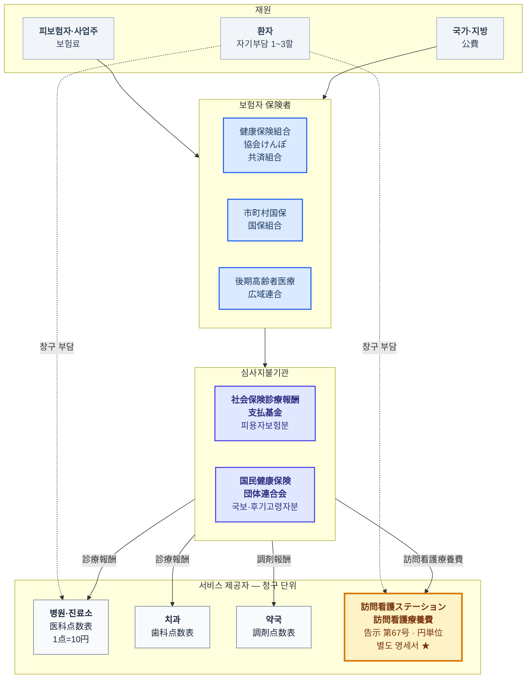
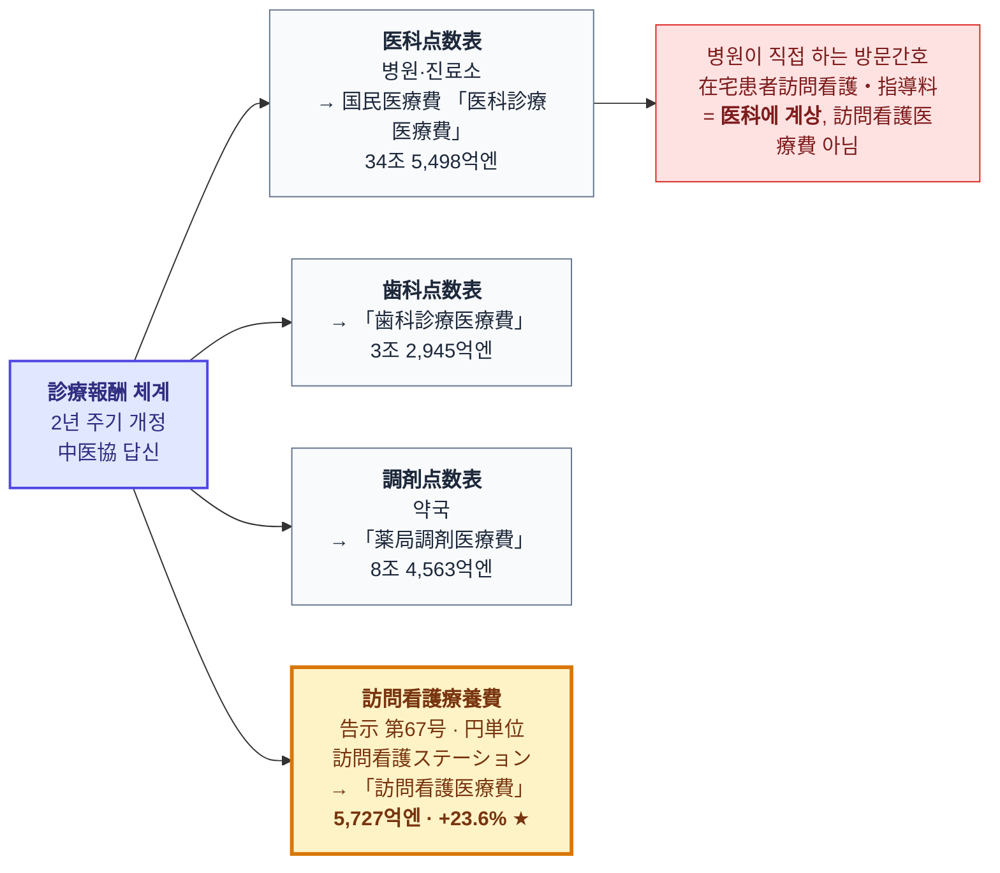
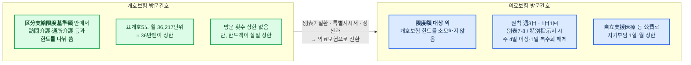

# 문서 7. 의료보험 자금 흐름 다이어그램 — 방문간호는 어디에 있는가

> 조사 기준일: 2026-09-13
> [문서 1](1_계층구조_다이어그램) §2가 "누가 보험자인가"(제도 계통)를 그렸다면, 이 문서는 **"돈이 어디로 흐르고, 어느 보수표로 값이 매겨지는가"** 를 그립니다.
> 방문간호의 위치는 이 층위에서 봐야 정확히 보입니다.

---

## 1. 한 장 요약 — 방문간호는 診療報酬点数表 바깥에 있다

일본 의료보험의 급여는 대부분 **診療報酬点数表**(1点=10円)로 값이 매겨집니다.
그런데 **訪問看護ステーション이 청구하는 訪問看護療養費는 이 점수표에 없습니다.**
별도 告示(厚生労働省告示 第67号, 平成20년 3월 5일 「訪問看護療養費に係る指定訪問看護の費用の額の算定方法」)로 **円 단위**로 정해지고,
**별도 청구서(訪問看護療養費明細書)** 로 청구됩니다.

같은 "방문간호"라도 **병원·진료소가 직접 하는 것**(みなし指定)은 医科点数表의 「在宅患者訪問看護・指導料」로 청구되어 **医科診療医療費**에 잡히고,
**스테이션이 하는 것**은 訪問看護療養費로 청구되어 국민의료비의 **「訪問看護医療費」** 에 잡힙니다.

> 즉 우리가 "+23.6%"라고 부른 그 수치는 **스테이션이 의료보험에 청구한 금액만**입니다.
> 병원 방문간호도, 개호보험 방문간호도 들어 있지 않습니다. 이 정의를 놓치면 시장 규모와 성장률을 모두 잘못 읽습니다.

---

## 2. 자금 흐름 전체도

### 읽는 법

| 단계 | 내용 |
|---|---|
| 재원 | 보험료 약 50% + 公費 약 37.5% + 환자부담 약 12% (2023년도 국민의료비 재원 구성, [문서 1](1_계층구조_다이어그램)) |
| 보험자 | 3계통. 75세 이상은 後期高齢者医療広域連合으로 이관. 訪問看護 이용자의 다수가 이 계통 |
| 심사지불기관 | 청구서(レセプト)를 심사하고 지불. 스테이션은 피용자보험분은 支払基金, 국보·후기고령자분은 国保連에 청구 |
| 제공자 | **네 개의 서로 다른 보수표**. 스테이션만 円 단위 告示 |

---

## 3. 보수체계 안에서의 위치 — 네 갈래 중 하나

*금액은 2023년도(令和5年度) 국민의료비, 신뢰도 A.*

### 訪問看護療養費의 실제 단가 (2024년 6월 개정 기준, 円)

| 항목 | 금액 | 비고 |
|---|---:|---|
| 訪問看護基本療養費(Ⅰ) 30分以上 | **5,550円/일** | 週3日까지 원칙 |
| 精神科訪問看護基本療養費 30分未満 | 4,250円/일 | 정신과 단시간 |
| 訪問看護管理療養費 1 | **3,000円/일** | 2024년 신설 구분 — 同一建物居住者 7할 미만 등 요건 |
| 訪問看護管理療養費 2 | 2,500円/일 | 위 요건 미충족 |

> 방문 1회에 기본 5,550円 + 관리 3,000円 = **약 8,500円**이 스테이션의 기본 수입입니다.
> 여기에 24시간대응체제·기능강화형·ターミナルケア 등 가산이 붙습니다.

---

## 4. 방문간호의 이중 소속 — 그리고 "限度額"이라는 결정적 차이

방문간호는 의료보험 안의 한 갈래이면서, 동시에 개호보험 안의 한 갈래이기도 합니다. 어느 쪽이 적용되는지는 [문서 1](1_계층구조_다이어그램) §4의 판정 흐름을 따릅니다.
여기서는 **왜 그 구분이 돈의 크기를 바꾸는지**만 봅니다.

### 이것이 만드는 인센티브

| 관점 | 개호보험 방문간호 | 의료보험 방문간호 |
|---|---|---|
| 이용자 | 방문간호를 쓰면 **헬퍼·데이서비스 쓸 한도가 줄어듦** | 한도와 무관 — **개호 한도를 온전히 다른 서비스에 쓸 수 있음** |
| 케어매니 | 한도 안에서 플랜을 짜야 함 | 의료보험 전환 시 플랜이 넉넉해짐 |
| 스테이션 | 한도에 막혀 방문을 늘리기 어려움 | 別表7·특별지시서·정신과면 **횟수 제한 해제**, 청구 상한 없음 |
| 자기부담 | 1~3할 | 1~3할이나 **公費(自立支援医療·難病)** 적용 시 1할·월 상한 |

> **세 당사자 모두에게 의료보험 쪽이 유리합니다.** 제도가 합법적 전환 경로(別表7·특별지시서·정신과)를 열어 두었으므로,
> 그 경로로 물량이 이동하는 것은 자연스러운 귀결입니다.
> 이것이 [문서 6](6_방문간호는_왜_혼자_성장했는가)에서 다루는 "왜 성장이 개호보험이 아니라 의료보험 쪽에서 나오는가"의 제도적 뿌리입니다.

---

## 5. 정리 — 방문간호의 좌표

| 층위 | 방문간호의 위치 |
|---|---|
| 제도 | 의료보험 **과** 개호보험 양쪽 (이중 소속) |
| 보험자 | 이용자의 연령·상태에 따라 3계통 어디든. 75세 이상은 後期高齢者医療 |
| 보수표 | 診療報酬点数表 **바깥** — 告示 第67号 訪問看護療養費 (円単位) |
| 청구 | 별도 명세서 → 支払基金 / 国保連 |
| 통계 | 국민의료비 **「訪問看護医療費」** (스테이션분만) / 개호급여비 **「訪問看護費」** |
| 한도 | 개호보험분은 限度額 내, **의료보험분은 限度額 대상 외** |
| 개정 주기 | 의료보험분 2년(診療報酬), 개호보험분 3년(介護報酬) — **6년마다 동시개정** (직근 2024, 다음 2030) |

---

[← 문서 6](6_방문간호는_왜_혼자_성장했는가) · [목록](index) · [다음: 성장 수치의 출처 감사 →](8_성장_수치의_출처와_신뢰성)
